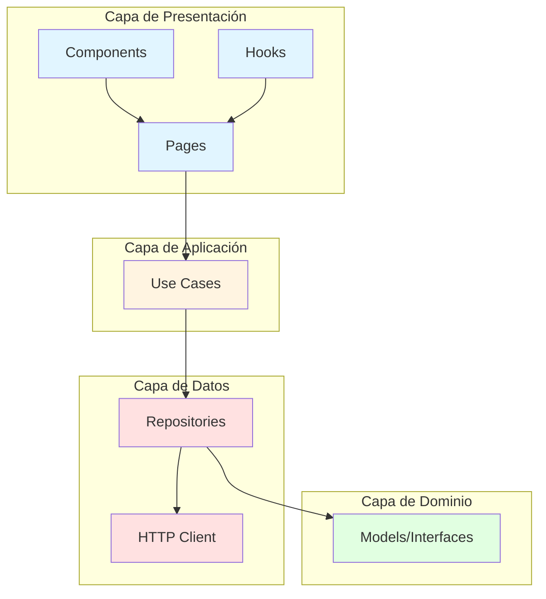
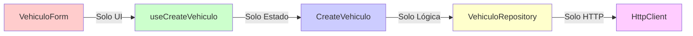
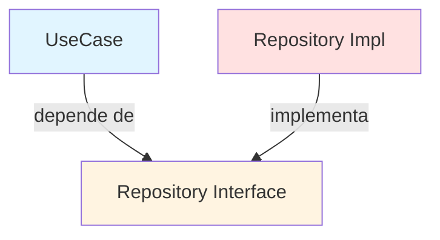
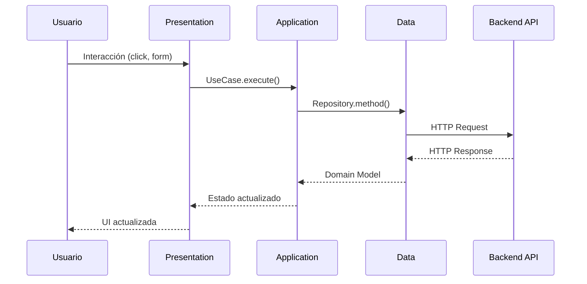

# Configuración Inicial del Proyecto

## Descripción General

Este documento explica la configuración inicial del proyecto React para el sistema de gestión de vehículos, siguiendo los principios de **Clean Architecture** y **SOLID**.

## Tecnologías Utilizadas

- **React 19** con TypeScript
- **Vite** como bundler
- **React Router DOM v6** para navegación
- **Tailwind CSS v3.4.1** para estilos
- **Fetch API nativa** (sin librerías de terceros)

## Arquitectura del Proyecto

El proyecto sigue **Clean Architecture** de Robert C. Martin, organizado en 4 capas concéntricas:



## Estructura de Carpetas

```
src/
├── domain/              # Capa de Dominio (Entidades y Contratos)
│   └── models/         # Interfaces y tipos de datos
│       ├── Vehiculo.ts
│       ├── Marca.ts
│       └── Modelo.ts
│
├── data/               # Capa de Datos (Implementación de acceso a datos)
│   ├── http/          # Cliente HTTP
│   │   ├── HttpClient.ts        (Interface)
│   │   └── FetchHttpClient.ts   (Implementación)
│   └── repositories/   # Implementación de repositorios
│       ├── VehiculoRepositoryImpl.ts
│       ├── MarcaRepositoryImpl.ts
│       └── ModeloRepositoryImpl.ts
│
├── application/        # Capa de Aplicación (Casos de Uso)
│   └── usecases/
│       ├── GetVehiculos.ts
│       ├── GetVehiculoById.ts
│       ├── CreateVehiculo.ts
│       ├── UpdateVehiculo.ts
│       ├── DeleteVehiculo.ts
│       ├── GetMarcas.ts
│       └── GetModelos.ts
│
├── presentation/       # Capa de Presentación (UI)
│   ├── components/    # Componentes reutilizables
│   │   ├── VehiculoList.tsx
│   │   ├── VehiculoForm.tsx
│   │   └── Pagination.tsx
│   ├── pages/         # Páginas completas
│   │   ├── VehiculosPage.tsx
│   │   ├── CreateVehiculoPage.tsx
│   │   ├── EditVehiculoPage.tsx
│   │   └── DetailVehiculoPage.tsx
│   └── hooks/         # Custom Hooks
│       ├── useVehiculos.ts
│       ├── useVehiculoById.ts
│       ├── useCreateVehiculo.ts
│       ├── useUpdateVehiculo.ts
│       ├── useDeleteVehiculo.ts
│       ├── useMarcasModelos.ts
│       └── usePagination.ts
│
└── config/            # Configuración
    └── apiConfig.ts
```

## Principios SOLID Aplicados

### 1. Single Responsibility Principle (SRP)

Cada clase/módulo tiene una única responsabilidad:

- **Modelos**: Solo definen la estructura de datos
- **Repositorios**: Solo se encargan del acceso a datos
- **Use Cases**: Solo contienen la lógica de negocio
- **Components**: Solo se encargan de la presentación
- **Hooks**: Solo gestionan estado y efectos secundarios



### 2. Open/Closed Principle (OCP)

El código está abierto a extensión pero cerrado a modificación:

```typescript
// Interface que permite múltiples implementaciones
interface HttpClient {
  get<T>(url: string): Promise<T>;
  post<T>(url: string, data: unknown): Promise<T>;
  put<T>(url: string, data: unknown): Promise<T>;
  delete(url: string): Promise<void>;
}

// Implementación con Fetch (se puede cambiar por Axios sin modificar el resto)
class FetchHttpClient implements HttpClient {
  // Implementación...
}
```

### 3. Liskov Substitution Principle (LSP)

Las implementaciones pueden ser sustituidas por sus interfaces:

```typescript
// Cualquier implementación de HttpClient puede ser usada
const httpClient: HttpClient = new FetchHttpClient();
const repository = new VehiculoRepositoryImpl(httpClient);
```

### 4. Interface Segregation Principle (ISP)

Interfaces específicas y pequeñas:

```typescript
// Interface separada para cada entidad
interface VehiculoRepository {
  getAll(): Promise<VehiculoResponse[]>;
  getById(id: string): Promise<VehiculoDetalle>;
  create(vehiculo: VehiculoRequest): Promise<string>;
  update(id: string, vehiculo: VehiculoRequest): Promise<void>;
  delete(id: string): Promise<void>;
}
```

### 5. Dependency Inversion Principle (DIP)

Las capas superiores dependen de abstracciones, no de implementaciones concretas:



## Configuración de Tailwind CSS

### Instalación

```bash
npm install -D tailwindcss@3.4.1 postcss autoprefixer
```

### Configuración (`tailwind.config.js`)

```javascript
export default {
  content: [
    "./index.html",
    "./src/**/*.{js,ts,jsx,tsx}",
  ],
  theme: {
    extend: {
      fontFamily: {
        sans: ['Poppins', 'sans-serif'],
      },
    },
  },
  plugins: [],
}
```

### PostCSS (`postcss.config.js`)

```javascript
export default {
  plugins: {
    tailwindcss: {},
    autoprefixer: {},
  },
}
```

### CSS Global (`src/index.css`)

```css
@tailwind base;
@tailwind components;
@tailwind utilities;
```

## Configuración del API

### archivo: `config/apiConfig.ts`

```typescript
export const API_CONFIG = {
  BASE_URL: 'https://localhost:7251/api',
  ENDPOINTS: {
    VEHICULOS: '/Vehiculo',
    MARCAS: '/Marca',
    MODELOS: '/Modelo',
  }
};

export const API_BASE_URL = API_CONFIG.BASE_URL;
```

## Rutas de Navegación

```typescript
// App.tsx
import { BrowserRouter, Routes, Route } from 'react-router-dom';

<BrowserRouter>
  <Routes>
    <Route path="/" element={<VehiculosPage />} />
    <Route path="/crear" element={<CreateVehiculoPage />} />
    <Route path="/editar/:id" element={<EditVehiculoPage />} />
    <Route path="/detalle/:id" element={<DetailVehiculoPage />} />
  </Routes>
</BrowserRouter>
```

## Flujo de Datos General



## Ventajas de esta Arquitectura

### 1. **Testabilidad**
- Cada capa se puede probar independientemente
- Fácil crear mocks de dependencias

### 2. **Mantenibilidad**
- Código organizado y fácil de encontrar
- Cambios localizados en capas específicas

### 3. **Escalabilidad**
- Agregar nuevas features es sistemático
- Patrones consistentes en todo el proyecto

### 4. **Independencia del Framework**
- La lógica de negocio no depende de React
- Fácil migrar a otro framework si es necesario

### 5. **Reutilización**
- Components y hooks reutilizables
- Use cases pueden ser compartidos

## Convenciones de Código

### Nomenclatura

- **Interfaces**: PascalCase (`VehiculoRepository`)
- **Componentes**: PascalCase (`VehiculoList`)
- **Hooks**: camelCase con prefijo `use` (`useVehiculos`)
- **Variables**: camelCase (`vehiculosList`)
- **Constantes**: UPPER_SNAKE_CASE (`API_BASE_URL`)

### Organización de Imports

```typescript
// 1. Imports de React
import { useState, useEffect } from 'react';

// 2. Imports de librerías
import { useNavigate } from 'react-router-dom';

// 3. Imports de capas internas (desde más abstracto a más concreto)
import { VehiculoResponse } from '../../domain/models/Vehiculo';
import { GetVehiculos } from '../../application/usecases/GetVehiculos';
import { VehiculoList } from '../components/VehiculoList';
```

## Próximos Pasos

Consulta los siguientes documentos para entender cada operación CRUD:

1. [Listar Vehículos (GET)](./01-get-listar-vehiculos.md)
2. [Crear Vehículo (POST)](./02-post-crear-vehiculo.md)
3. [Ver Detalle Vehículo (GET by ID)](./03-get-detalle-vehiculo.md)
4. [Editar Vehículo (PUT)](./04-put-editar-vehiculo.md)
5. [Eliminar Vehículo (DELETE)](./05-delete-eliminar-vehiculo.md)

---

## Referencias

- [Clean Architecture - Robert C. Martin](https://blog.cleancoder.com/uncle-bob/2012/08/13/the-clean-architecture.html)
- [SOLID Principles](https://en.wikipedia.org/wiki/SOLID)
- [React Documentation](https://react.dev/)
- [Tailwind CSS](https://tailwindcss.com/)
