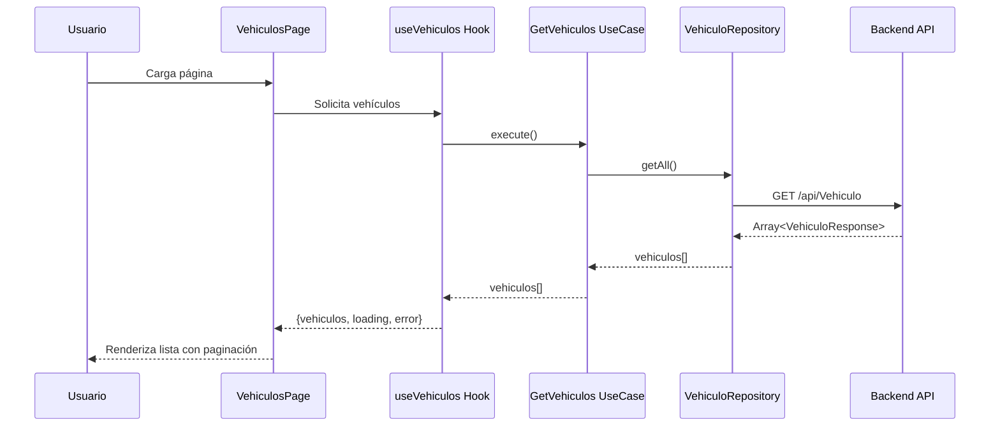
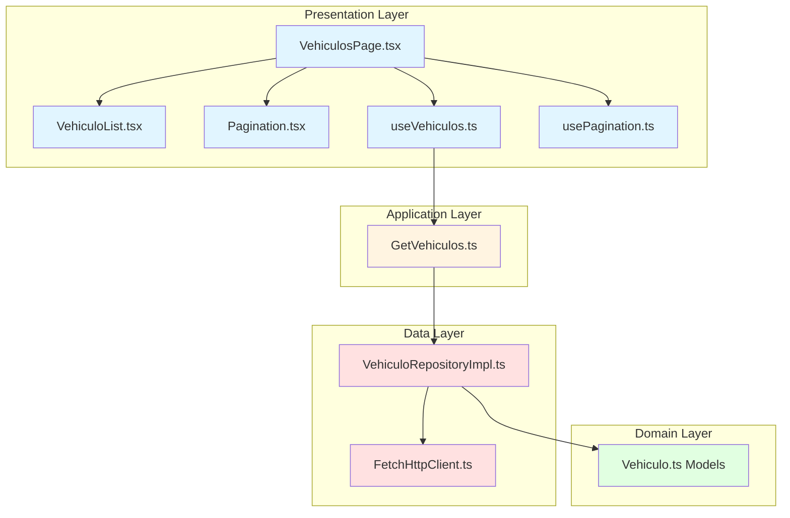
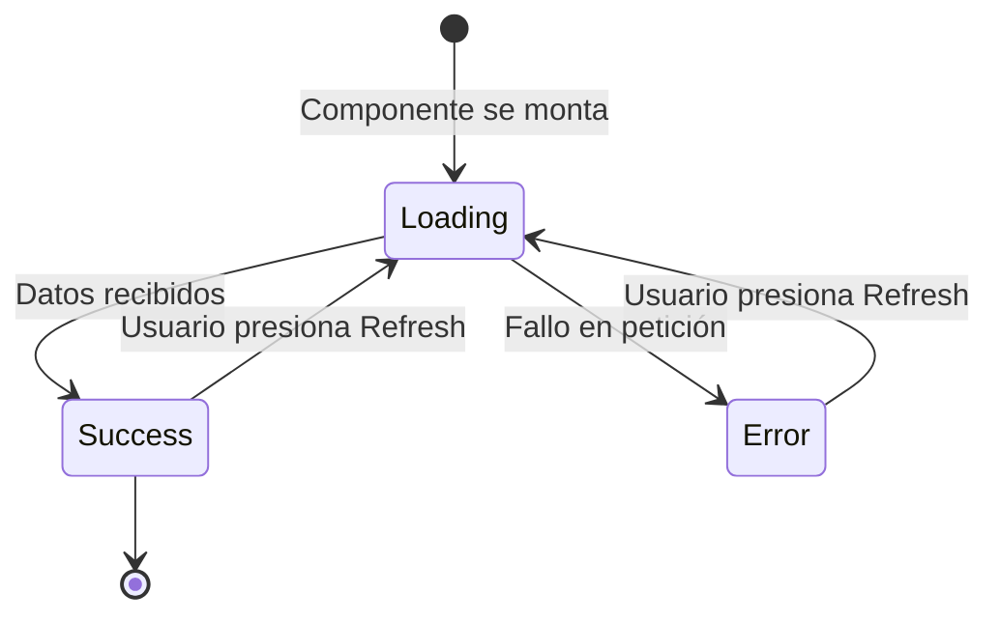
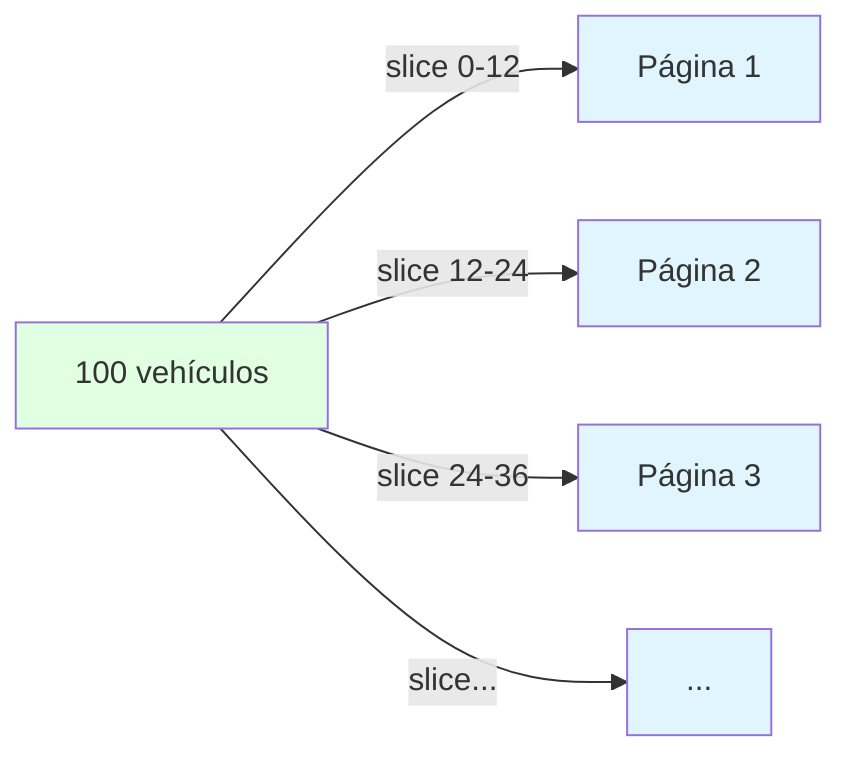

# Listar Vehículos (GET)

## Descripción General

Esta funcionalidad permite obtener y mostrar la lista completa de vehículos registrados en el sistema, con paginación de 12 elementos por página.

## Endpoint utilizado

```
GET https://localhost:7251/api/Vehiculo
```

## Flujo de la Operación



## Arquitectura en Capas



## Implementación por Capas

### 1. Capa de Dominio (Domain Layer)

Define los modelos de datos y contratos.

**Archivo**: `domain/models/Vehiculo.ts`

```typescript
export interface VehiculoResponse {
  id: string;
  placa: string;
  color: string;
  anio: number;
  precio: number;
  marca: string;
  modelo: string;
  correoPropietario: string;
  telefonoPropietario: string;
}
```

**Principio SOLID aplicado**: 
- **ISP (Interface Segregation)**: Interface específica solo con los campos necesarios para listar

### 2. Capa de Datos (Data Layer)

#### HttpClient Interface

**Archivo**: `data/http/HttpClient.ts`

```typescript
export interface HttpClient {
  get<T>(url: string): Promise<T>;
  post<T>(url: string, data: unknown): Promise<T>;
  put<T>(url: string, data: unknown): Promise<T>;
  delete(url: string): Promise<void>;
}
```

**Principio SOLID aplicado**:
- **DIP (Dependency Inversion)**: Las capas superiores dependen de la interfaz, no de la implementación

#### HttpClient Implementation

**Archivo**: `data/http/FetchHttpClient.ts`

```typescript
export class FetchHttpClient implements HttpClient {
  async get<T>(url: string): Promise<T> {
    const response = await fetch(url, {
      method: 'GET',
      headers: {
        'Content-Type': 'application/json',
      },
    });

    if (!response.ok) {
      throw new Error(`HTTP Error: ${response.status}`);
    }

    // Manejar respuesta vacía (204 No Content)
    if (response.status === 204) {
      return {} as T;
    }

    return await response.json();
  }
}
```

**Principios SOLID aplicados**:
- **SRP (Single Responsibility)**: Solo se encarga de hacer peticiones HTTP
- **OCP (Open/Closed)**: Se puede extender creando nuevas implementaciones sin modificar el código existente

#### Repository Implementation

**Archivo**: `data/repositories/VehiculoRepositoryImpl.ts`

```typescript
import { VehiculoResponse } from '../../domain/models/Vehiculo';
import { HttpClient } from '../http/HttpClient';
import { API_CONFIG } from '../../config/apiConfig';

export class VehiculoRepositoryImpl {
  constructor(private httpClient: HttpClient) {}

  async getAll(): Promise<VehiculoResponse[]> {
    const url = `${API_CONFIG.BASE_URL}${API_CONFIG.ENDPOINTS.VEHICULOS}`;
    return await this.httpClient.get<VehiculoResponse[]>(url);
  }
}
```

**Principios SOLID aplicados**:
- **DIP (Dependency Inversion)**: Depende de HttpClient interface, no de implementación concreta
- **SRP (Single Responsibility)**: Solo se encarga de la comunicación con el API de vehículos

### 3. Capa de Aplicación (Application Layer)

**Archivo**: `application/usecases/GetVehiculos.ts`

```typescript
import { VehiculoResponse } from '../../domain/models/Vehiculo';
import { VehiculoRepositoryImpl } from '../../data/repositories/VehiculoRepositoryImpl';

export class GetVehiculos {
  constructor(private repository: VehiculoRepositoryImpl) {}

  async execute(): Promise<VehiculoResponse[]> {
    return await this.repository.getAll();
  }
}
```

**Principios aplicados**:
- **SRP**: Solo contiene la lógica del caso de uso "obtener vehículos"
- **DIP**: Depende de la abstracción del repositorio

### 4. Capa de Presentación (Presentation Layer)

#### Custom Hook

**Archivo**: `presentation/hooks/useVehiculos.ts`

```typescript
import { useState, useEffect, useCallback, useMemo } from 'react';
import { VehiculoResponse } from '../../domain/models/Vehiculo';
import { GetVehiculos } from '../../application/usecases/GetVehiculos';
import { VehiculoRepositoryImpl } from '../../data/repositories/VehiculoRepositoryImpl';
import { FetchHttpClient } from '../../data/http/FetchHttpClient';

export const useVehiculos = () => {
  const [vehiculos, setVehiculos] = useState<VehiculoResponse[]>([]);
  const [loading, setLoading] = useState(true);
  const [error, setError] = useState<string | null>(null);

  // Memoizar instancias para evitar recreación en cada render
  const getVehiculosUseCase = useMemo(() => {
    const httpClient = new FetchHttpClient();
    const repository = new VehiculoRepositoryImpl(httpClient);
    return new GetVehiculos(repository);
  }, []);

  const fetchVehiculos = useCallback(async () => {
    try {
      setLoading(true);
      setError(null);
      const data = await getVehiculosUseCase.execute();
      setVehiculos(data);
    } catch (err) {
      setError('Error al cargar los vehículos');
      console.error(err);
    } finally {
      setLoading(false);
    }
  }, [getVehiculosUseCase]);

  useEffect(() => {
    fetchVehiculos();
  }, [fetchVehiculos]);

  return { 
    vehiculos, 
    loading, 
    error, 
    refresh: fetchVehiculos 
  };
};
```

**Buenas prácticas de React**:
- **useMemo**: Evita recrear instancias en cada render
- **useCallback**: Memoiza la función de fetch
- **Custom Hook**: Encapsula lógica reutilizable

#### Pagination Hook

**Archivo**: `presentation/hooks/usePagination.ts`

```typescript
import { useState, useMemo } from 'react';

interface UsePaginationParams<T> {
  items: T[];
  itemsPerPage: number;
}

export const usePagination = <T,>({ items, itemsPerPage }: UsePaginationParams<T>) => {
  const [currentPage, setCurrentPage] = useState(1);

  // Calcular totales
  const totalPages = Math.ceil(items.length / itemsPerPage);
  const totalItems = items.length;

  // Obtener items de la página actual
  const paginatedItems = useMemo(() => {
    const startIndex = (currentPage - 1) * itemsPerPage;
    const endIndex = startIndex + itemsPerPage;
    return items.slice(startIndex, endIndex);
  }, [items, currentPage, itemsPerPage]);

  // Funciones de navegación
  const goToPage = (page: number) => {
    if (page >= 1 && page <= totalPages) {
      setCurrentPage(page);
    }
  };

  const resetPagination = () => {
    setCurrentPage(1);
  };

  return {
    currentPage,
    totalPages,
    paginatedItems,
    goToPage,
    itemsPerPage,
    totalItems,
    resetPagination,
  };
};
```

**Principios aplicados**:
- **SRP**: Solo se encarga de la lógica de paginación
- **Reusabilidad**: Hook genérico que funciona con cualquier tipo de datos

#### Componente de Lista

**Archivo**: `presentation/components/VehiculoList.tsx`

```typescript
import { VehiculoResponse } from '../../domain/models/Vehiculo';

interface Props {
  vehiculos: VehiculoResponse[];
  loading: boolean;
  error: string | null;
  onEdit: (id: string) => void;
  onDelete: (id: string) => void;
  onViewDetail: (id: string) => void;
}

export const VehiculoList = ({ vehiculos, loading, error, onEdit, onDelete, onViewDetail }: Props) => {
  if (loading) {
    return (
      <div className="flex justify-center items-center py-20">
        <div className="w-16 h-16 border-4 border-indigo-500/30 border-t-indigo-500 rounded-full animate-spin"></div>
      </div>
    );
  }

  if (error) {
    return (
      <div className="bg-red-50 border border-red-200 rounded-xl p-6 text-center">
        <p className="text-red-600 font-semibold">{error}</p>
      </div>
    );
  }

  if (vehiculos.length === 0) {
    return (
      <div className="bg-white rounded-2xl shadow-lg p-12 text-center">
        <p className="text-gray-500 text-lg">No hay vehículos registrados</p>
      </div>
    );
  }

  return (
    <div className="grid grid-cols-1 md:grid-cols-2 lg:grid-cols-3 gap-6">
      {vehiculos.map((vehiculo) => (
        <div key={vehiculo.id} className="bg-white rounded-2xl shadow-lg overflow-hidden hover:shadow-xl transition-shadow">
          {/* Imagen placeholder */}
          <div className="bg-gradient-to-br from-indigo-500 to-purple-600 h-48 flex items-center justify-center">
            <svg className="w-24 h-24 text-white/80" fill="currentColor" viewBox="0 0 24 24">
              <path d="M18.92 6.01C18.72 5.42 18.16 5 17.5 5h-11c-.66 0-1.21.42-1.42 1.01L3 12v8c0 .55.45 1 1 1h1c.55 0 1-.45 1-1v-1h12v1c0 .55.45 1 1 1h1c.55 0 1-.45 1-1v-8l-2.08-5.99zM6.5 16c-.83 0-1.5-.67-1.5-1.5S5.67 13 6.5 13s1.5.67 1.5 1.5S7.33 16 6.5 16zm11 0c-.83 0-1.5-.67-1.5-1.5s.67-1.5 1.5-1.5 1.5.67 1.5 1.5-.67 1.5-1.5 1.5zM5 11l1.5-4.5h11L19 11H5z"/>
            </svg>
          </div>
          
          {/* Información del vehículo */}
          <div className="p-6">
            <h3 className="text-xl font-bold text-gray-900 mb-2">
              {vehiculo.marca} {vehiculo.modelo}
            </h3>
            <div className="space-y-2 text-sm text-gray-600 mb-4">
              <p><span className="font-semibold">Placa:</span> {vehiculo.placa}</p>
              <p><span className="font-semibold">Año:</span> {vehiculo.anio}</p>
              <p><span className="font-semibold">Color:</span> {vehiculo.color}</p>
              <p className="text-lg font-bold text-indigo-600">
                ${vehiculo.precio.toLocaleString()}
              </p>
            </div>
            
            {/* Botones de acción */}
            <div className="flex gap-2">
              <button
                onClick={() => onViewDetail(vehiculo.id)}
                className="flex-1 bg-gradient-to-br from-indigo-500 to-purple-600 text-white px-4 py-2 rounded-lg hover:shadow-lg transition-all hover:-translate-y-0.5"
              >
                Ver
              </button>
              <button
                onClick={() => onEdit(vehiculo.id)}
                className="bg-gray-100 text-gray-700 px-4 py-2 rounded-lg hover:bg-gray-200 transition"
              >
                ✏️
              </button>
              <button
                onClick={() => onDelete(vehiculo.id)}
                className="bg-red-50 text-red-600 px-4 py-2 rounded-lg hover:bg-red-100 transition"
              >
                🗑️
              </button>
            </div>
          </div>
        </div>
      ))}
    </div>
  );
};
```

**Principios aplicados**:
- **SRP**: Solo se encarga de renderizar la lista
- **Props**: Recibe callbacks para acciones (Dependency Injection)

#### Página Principal

**Archivo**: `presentation/pages/VehiculosPage.tsx`

```typescript
import { useState } from 'react';
import { useNavigate } from 'react-router-dom';
import { useVehiculos } from '../hooks/useVehiculos';
import { useDeleteVehiculo } from '../hooks/useDeleteVehiculo';
import { usePagination } from '../hooks/usePagination';
import { VehiculoList } from '../components/VehiculoList';
import { Pagination } from '../components/Pagination';

export const VehiculosPage = () => {
  const navigate = useNavigate();
  const { vehiculos, loading, error, refresh } = useVehiculos();
  const { deleteVehiculo, loading: deleting } = useDeleteVehiculo();
  const [showDeleteModal, setShowDeleteModal] = useState(false);
  const [vehiculoToDelete, setVehiculoToDelete] = useState<string | null>(null);
  
  const {
    currentPage,
    totalPages,
    paginatedItems,
    goToPage,
    itemsPerPage,
    totalItems,
    resetPagination,
  } = usePagination({ items: vehiculos, itemsPerPage: 12 });

  return (
    <section className="bg-gray-50 min-h-screen py-16 px-6">
      {/* Hero Section con información */}
      
      {/* Lista de vehículos paginada */}
      <VehiculoList 
        vehiculos={paginatedItems} 
        loading={loading} 
        error={error}
        onEdit={(id) => navigate(`/editar/${id}`)}
        onDelete={handleDelete}
        onViewDetail={(id) => navigate(`/detalle/${id}`)}
      />

      {/* Paginación */}
      {!loading && !error && vehiculos.length > 0 && (
        <Pagination
          currentPage={currentPage}
          totalPages={totalPages}
          onPageChange={goToPage}
          itemsPerPage={itemsPerPage}
          totalItems={totalItems}
        />
      )}
    </section>
  );
};
```

## Flujo de Estados



## Manejo de Estados

El hook `useVehiculos` maneja 3 estados principales:

1. **loading**: `true` mientras se cargan los datos
2. **error**: String con mensaje de error si falla
3. **vehiculos**: Array con los datos obtenidos

```typescript
{
  loading: boolean;
  error: string | null;
  vehiculos: VehiculoResponse[];
  refresh: () => Promise<void>;
}
```

## Paginación

La paginación se implementa en el cliente usando `usePagination`:

- **12 elementos por página**
- Navegación entre páginas
- Muestra números de página inteligentes (1...3 4 5...10)
- Se resetea al refrescar la lista



## Ventajas de esta Implementación

### 1. Separación de Responsabilidades
- Cada capa tiene su función específica
- Fácil de mantener y extender

### 2. Testabilidad
- Cada capa se puede probar independientemente
- Fácil crear mocks

### 3. Reutilización
- `usePagination` es genérico y reutilizable
- `VehiculoList` es un componente presentacional puro

### 4. Rendimiento
- `useMemo` y `useCallback` optimizan renders
- Paginación en cliente reduce transferencia de datos

### 5. UX Mejorada
- Estados de carga claros
- Mensajes de error informativos
- Diseño responsive con Tailwind

## Posibles Mejoras Futuras

1. **Paginación en servidor**: Para listas muy grandes
2. **Caché**: Almacenar datos en localStorage o React Query
3. **Búsqueda y filtros**: Implementar filtros por marca, año, precio
4. **Ordenamiento**: Permitir ordenar por diferentes campos
5. **Infinite scroll**: Como alternativa a la paginación tradicional

---

**Siguiente**: [Crear Vehículo (POST)](./02-post-crear-vehiculo.md)
