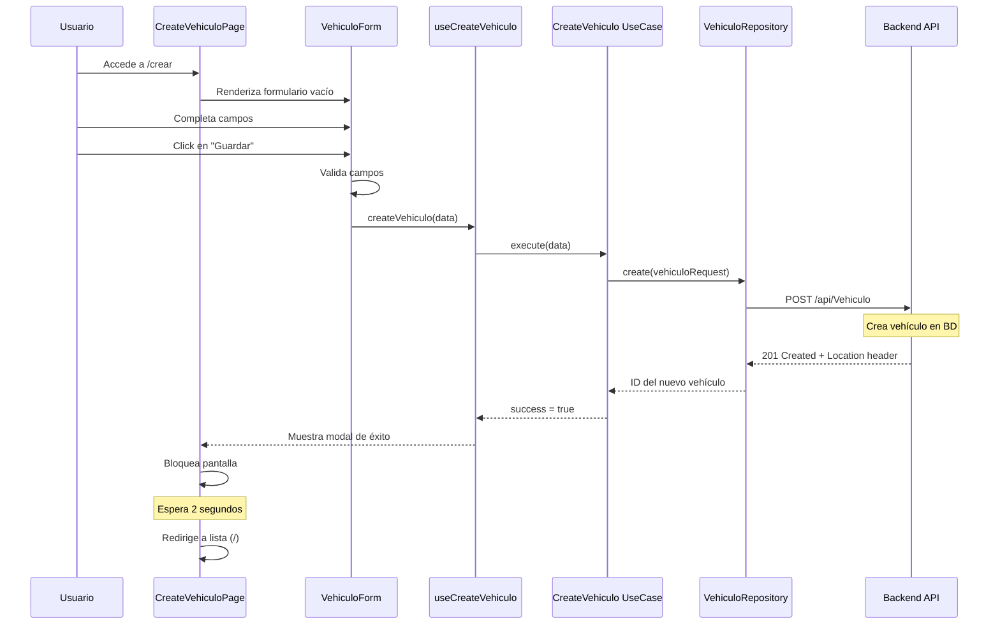
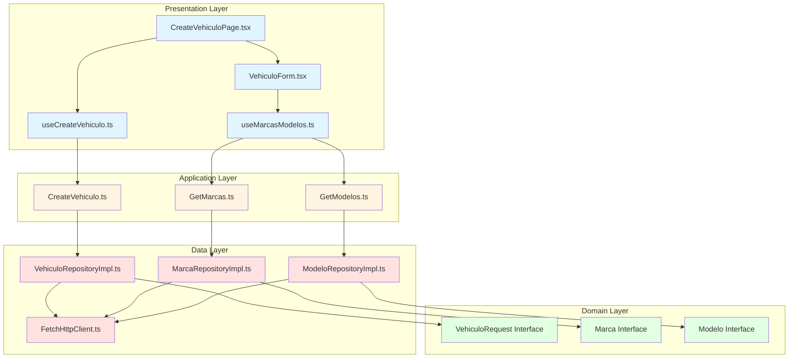
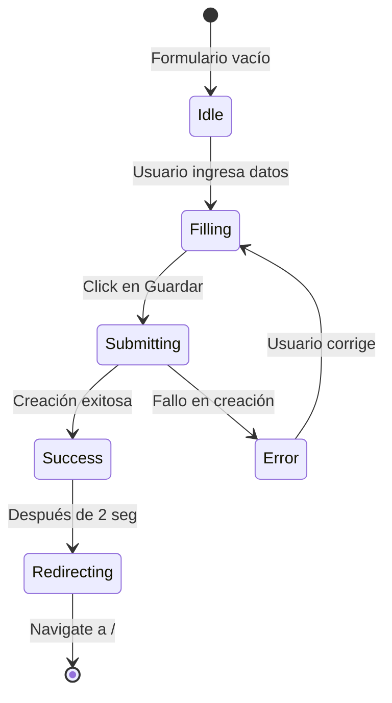
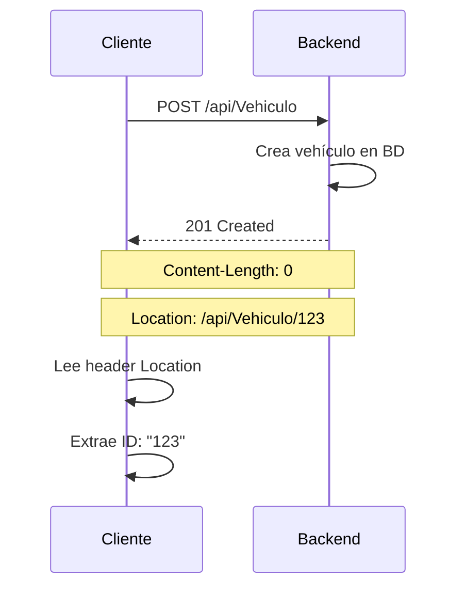

# Crear Vehículo (POST)

## Descripción General

Esta funcionalidad permite crear un nuevo vehículo en el sistema mediante un formulario validado. El usuario ingresa todos los datos del vehículo, se validan en el cliente, y se envían al backend para su almacenamiento.

## Endpoint utilizado

```
POST https://localhost:7251/api/Vehiculo
Content-Type: application/json
```

## Flujo de la Operación



## Arquitectura en Capas



## Implementación por Capas

### 1. Capa de Dominio (Domain Layer)

**Archivo**: `domain/models/Vehiculo.ts`

```typescript
// Modelo base con campos comunes
export interface VehiculoBase {
  placa: string;
  color: string;
  anio: number;
  precio: number;
  correoPropietario: string;
  telefonoPropietario: string;
}

// Request para crear (sin ID)
export interface VehiculoRequest extends VehiculoBase {
  idMarca: string;
  idModelo: string;
}
```

**Principio aplicado**:
- **ISP (Interface Segregation)**: Interfaces separadas según el contexto de uso
- Request no incluye `id` porque es generado por el backend

**Archivo**: `domain/models/Marca.ts` y `Modelo.ts`

```typescript
export interface Marca {
  id: string;
  nombre: string;
}

export interface Modelo {
  id: string;
  nombre: string;
  idMarca: string;
}
```

### 2. Capa de Datos (Data Layer)

#### Manejo de Respuestas Vacías

**Archivo**: `data/http/FetchHttpClient.ts`

```typescript
export class FetchHttpClient implements HttpClient {
  async post<T>(url: string, data: unknown): Promise<T> {
    const response = await fetch(url, {
      method: 'POST',
      headers: {
        'Content-Type': 'application/json',
      },
      body: JSON.stringify(data),
    });

    if (!response.ok) {
      throw new Error(`HTTP Error: ${response.status}`);
    }

    // El API devuelve 201 Created con Content-Length: 0
    // Extraer el ID del header Location
    if (response.status === 201) {
      const contentLength = response.headers.get('Content-Length');
      if (contentLength === '0') {
        const location = response.headers.get('Location');
        if (location) {
          const id = location.split('/').pop();
          return { id } as T;
        }
        return {} as T;
      }
    }

    return await response.json();
  }
}
```

**Desafío resuelto**: 
- El backend ASP.NET Core devuelve 201 Created pero sin body
- Se extrae el ID del header `Location: /api/Vehiculo/{id}`
- Evita error "Unexpected end of JSON input"

#### Repository Implementation

**Archivo**: `data/repositories/VehiculoRepositoryImpl.ts`

```typescript
import { VehiculoRequest } from '../../domain/models/Vehiculo';
import { HttpClient } from '../http/HttpClient';
import { API_CONFIG } from '../../config/apiConfig';

export class VehiculoRepositoryImpl {
  constructor(private httpClient: HttpClient) {}

  async create(vehiculo: VehiculoRequest): Promise<string> {
    const url = `${API_CONFIG.BASE_URL}${API_CONFIG.ENDPOINTS.VEHICULOS}`;
    const response = await this.httpClient.post<{ id: string }>(url, vehiculo);
    return response.id || '';
  }
}
```

**Principio aplicado**:
- **SRP**: Solo se encarga de comunicarse con el API de vehículos
- Transforma el response a un simple string (ID)

### 3. Capa de Aplicación (Application Layer)

**Archivo**: `application/usecases/CreateVehiculo.ts`

```typescript
import { VehiculoRequest } from '../../domain/models/Vehiculo';
import { VehiculoRepositoryImpl } from '../../data/repositories/VehiculoRepositoryImpl';

export class CreateVehiculo {
  constructor(private repository: VehiculoRepositoryImpl) {}

  async execute(vehiculo: VehiculoRequest): Promise<string> {
    // Aquí se puede agregar validación de negocio adicional
    // Por ejemplo: validar que el precio sea mayor a 0
    if (vehiculo.precio <= 0) {
      throw new Error('El precio debe ser mayor a 0');
    }

    if (vehiculo.anio < 1900 || vehiculo.anio > new Date().getFullYear() + 1) {
      throw new Error('El año es inválido');
    }

    return await this.repository.create(vehiculo);
  }
}
```

**Principio aplicado**:
- **SRP**: Contiene solo la lógica de negocio para crear vehículos
- Validaciones de negocio centralizadas

### 4. Capa de Presentación (Presentation Layer)

#### Hook de Creación

**Archivo**: `presentation/hooks/useCreateVehiculo.ts`

```typescript
import { useState, useMemo, useCallback } from 'react';
import { VehiculoRequest } from '../../domain/models/Vehiculo';
import { CreateVehiculo } from '../../application/usecases/CreateVehiculo';
import { VehiculoRepositoryImpl } from '../../data/repositories/VehiculoRepositoryImpl';
import { FetchHttpClient } from '../../data/http/FetchHttpClient';

export const useCreateVehiculo = () => {
  const [loading, setLoading] = useState(false);
  const [error, setError] = useState<string | null>(null);
  const [success, setSuccess] = useState(false);

  // Memoizar instancias
  const createVehiculoUseCase = useMemo(() => {
    const httpClient = new FetchHttpClient();
    const repository = new VehiculoRepositoryImpl(httpClient);
    return new CreateVehiculo(repository);
  }, []);

  const createVehiculo = useCallback(async (vehiculo: VehiculoRequest): Promise<boolean> => {
    try {
      setLoading(true);
      setError(null);
      setSuccess(false);
      
      await createVehiculoUseCase.execute(vehiculo);
      
      setSuccess(true);
      return true;
    } catch (err) {
      setError(err instanceof Error ? err.message : 'Error al crear el vehículo');
      console.error('Error creating vehiculo:', err);
      return false;
    } finally {
      setLoading(false);
    }
  }, [createVehiculoUseCase]);

  return { createVehiculo, loading, error, success };
};
```

**Buenas prácticas**:
- Estados separados para `loading`, `error`, `success`
- Retorna boolean para facilitar manejo en el componente
- Usa `useCallback` para evitar recreación

#### Hook para Marcas y Modelos

**Archivo**: `presentation/hooks/useMarcasModelos.ts`

```typescript
import { useState, useEffect, useMemo } from 'react';
import { Marca } from '../../domain/models/Marca';
import { Modelo } from '../../domain/models/Modelo';
import { GetMarcas } from '../../application/usecases/GetMarcas';
import { GetModelos } from '../../application/usecases/GetModelos';
import { MarcaRepositoryImpl } from '../../data/repositories/MarcaRepositoryImpl';
import { ModeloRepositoryImpl } from '../../data/repositories/ModeloRepositoryImpl';
import { FetchHttpClient } from '../../data/http/FetchHttpClient';

export const useMarcasModelos = (idMarca?: string) => {
  const [marcas, setMarcas] = useState<Marca[]>([]);
  const [modelos, setModelos] = useState<Modelo[]>([]);
  const [loading, setLoading] = useState(true);

  // Memoizar use cases
  const getMarcasUseCase = useMemo(() => {
    const httpClient = new FetchHttpClient();
    const repository = new MarcaRepositoryImpl(httpClient);
    return new GetMarcas(repository);
  }, []);

  const getModelosUseCase = useMemo(() => {
    const httpClient = new FetchHttpClient();
    const repository = new ModeloRepositoryImpl(httpClient);
    return new GetModelos(repository);
  }, []);

  // Cargar marcas al montar
  useEffect(() => {
    const fetchMarcas = async () => {
      try {
        const data = await getMarcasUseCase.execute();
        setMarcas(data);
      } catch (error) {
        console.error('Error loading marcas:', error);
      } finally {
        setLoading(false);
      }
    };
    fetchMarcas();
  }, [getMarcasUseCase]);

  // Cargar modelos cuando cambia idMarca
  useEffect(() => {
    if (!idMarca) {
      setModelos([]);
      return;
    }

    const fetchModelos = async () => {
      try {
        const data = await getModelosUseCase.execute(idMarca);
        setModelos(data);
      } catch (error) {
        console.error('Error loading modelos:', error);
        setModelos([]);
      }
    };
    fetchModelos();
  }, [idMarca, getModelosUseCase]);

  return { marcas, modelos, loading };
};
```

**Características**:
- Carga automática de marcas al montar
- Carga dinámica de modelos según marca seleccionada
- Manejo de estados de carga

#### Componente de Formulario

**Archivo**: `presentation/components/VehiculoForm.tsx`

```typescript
import { useState, useEffect } from 'react';
import { VehiculoBase } from '../../domain/models/Vehiculo';
import { useMarcasModelos } from '../hooks/useMarcasModelos';

interface Props {
  initialValues?: VehiculoBase & { idMarca?: string; idModelo?: string };
  onSubmit: (data: VehiculoBase & { idMarca: string; idModelo: string }) => void;
  loading: boolean;
  submitLabel?: string;
}

export const VehiculoForm = ({ 
  initialValues, 
  onSubmit, 
  loading,
  submitLabel = 'Guardar' 
}: Props) => {
  // Estados del formulario
  const [placa, setPlaca] = useState('');
  const [color, setColor] = useState('');
  const [anio, setAnio] = useState('');
  const [precio, setPrecio] = useState('');
  const [selectedMarca, setSelectedMarca] = useState('');
  const [selectedModelo, setSelectedModelo] = useState('');
  const [correoPropietario, setCorreoPropietario] = useState('');
  const [telefonoPropietario, setTelefonoPropietario] = useState('');

  // Cargar marcas y modelos
  const { marcas, modelos } = useMarcasModelos(selectedMarca);

  // Pre-poblar formulario si hay valores iniciales
  useEffect(() => {
    if (initialValues) {
      setPlaca(initialValues.placa || '');
      setColor(initialValues.color || '');
      setAnio(initialValues.anio?.toString() || '');
      setPrecio(initialValues.precio?.toString() || '');
      setCorreoPropietario(initialValues.correoPropietario || '');
      setTelefonoPropietario(initialValues.telefonoPropietario || '');
      if (initialValues.idMarca) setSelectedMarca(initialValues.idMarca);
      if (initialValues.idModelo) setSelectedModelo(initialValues.idModelo);
    }
  }, [initialValues]);

  const handleSubmit = (e: React.FormEvent) => {
    e.preventDefault();
    
    // Validación básica
    if (!placa || !color || !anio || !precio || !selectedMarca || !selectedModelo) {
      alert('Todos los campos son obligatorios');
      return;
    }

    onSubmit({
      placa,
      color,
      anio: parseInt(anio),
      precio: parseFloat(precio),
      idMarca: selectedMarca,
      idModelo: selectedModelo,
      correoPropietario,
      telefonoPropietario,
    });
  };

  return (
    <form onSubmit={handleSubmit} className="space-y-6">
      {/* Campo Placa */}
      <div>
        <label className="block text-sm font-semibold text-gray-700 mb-2">
          Placa *
        </label>
        <input
          type="text"
          value={placa}
          onChange={(e) => setPlaca(e.target.value)}
          disabled={loading}
          className="w-full px-4 py-3 border border-gray-300 rounded-xl focus:ring-2 focus:ring-indigo-500 focus:border-transparent disabled:bg-gray-100 disabled:cursor-not-allowed"
          placeholder="ABC123"
          required
        />
      </div>

      {/* Campo Color */}
      <div>
        <label className="block text-sm font-semibold text-gray-700 mb-2">
          Color *
        </label>
        <input
          type="text"
          value={color}
          onChange={(e) => setColor(e.target.value)}
          disabled={loading}
          className="w-full px-4 py-3 border border-gray-300 rounded-xl focus:ring-2 focus:ring-indigo-500 focus:border-transparent disabled:bg-gray-100 disabled:cursor-not-allowed"
          placeholder="Rojo"
          required
        />
      </div>

      {/* Campos Año y Precio en grid */}
      <div className="grid grid-cols-1 md:grid-cols-2 gap-6">
        <div>
          <label className="block text-sm font-semibold text-gray-700 mb-2">
            Año *
          </label>
          <input
            type="number"
            value={anio}
            onChange={(e) => setAnio(e.target.value)}
            disabled={loading}
            className="w-full px-4 py-3 border border-gray-300 rounded-xl focus:ring-2 focus:ring-indigo-500 focus:border-transparent disabled:bg-gray-100 disabled:cursor-not-allowed"
            placeholder="2024"
            min="1900"
            max={new Date().getFullYear() + 1}
            required
          />
        </div>
        <div>
          <label className="block text-sm font-semibold text-gray-700 mb-2">
            Precio *
          </label>
          <input
            type="number"
            value={precio}
            onChange={(e) => setPrecio(e.target.value)}
            disabled={loading}
            className="w-full px-4 py-3 border border-gray-300 rounded-xl focus:ring-2 focus:ring-indigo-500 focus:border-transparent disabled:bg-gray-100 disabled:cursor-not-allowed"
            placeholder="25000"
            step="0.01"
            min="0"
            required
          />
        </div>
      </div>

      {/* Selects de Marca y Modelo */}
      <div className="grid grid-cols-1 md:grid-cols-2 gap-6">
        <div>
          <label className="block text-sm font-semibold text-gray-700 mb-2">
            Marca *
          </label>
          <select
            value={selectedMarca}
            onChange={(e) => {
              setSelectedMarca(e.target.value);
              setSelectedModelo(''); // Reset modelo al cambiar marca
            }}
            disabled={loading}
            className="w-full px-4 py-3 border border-gray-300 rounded-xl focus:ring-2 focus:ring-indigo-500 focus:border-transparent disabled:bg-gray-100 disabled:cursor-not-allowed"
            required
          >
            <option value="">Seleccione una marca</option>
            {marcas.map((marca) => (
              <option key={marca.id} value={marca.id}>
                {marca.nombre}
              </option>
            ))}
          </select>
        </div>
        <div>
          <label className="block text-sm font-semibold text-gray-700 mb-2">
            Modelo *
          </label>
          <select
            value={selectedModelo}
            onChange={(e) => setSelectedModelo(e.target.value)}
            disabled={loading || !selectedMarca || modelos.length === 0}
            className="w-full px-4 py-3 border border-gray-300 rounded-xl focus:ring-2 focus:ring-indigo-500 focus:border-transparent disabled:bg-gray-100 disabled:cursor-not-allowed"
            required
          >
            <option value="">Seleccione un modelo</option>
            {modelos.map((modelo) => (
              <option key={modelo.id} value={modelo.id}>
                {modelo.nombre}
              </option>
            ))}
          </select>
        </div>
      </div>

      {/* Datos del Propietario */}
      <div className="grid grid-cols-1 md:grid-cols-2 gap-6">
        <div>
          <label className="block text-sm font-semibold text-gray-700 mb-2">
            Correo Propietario *
          </label>
          <input
            type="email"
            value={correoPropietario}
            onChange={(e) => setCorreoPropietario(e.target.value)}
            disabled={loading}
            className="w-full px-4 py-3 border border-gray-300 rounded-xl focus:ring-2 focus:ring-indigo-500 focus:border-transparent disabled:bg-gray-100 disabled:cursor-not-allowed"
            placeholder="propietario@email.com"
            required
          />
        </div>
        <div>
          <label className="block text-sm font-semibold text-gray-700 mb-2">
            Teléfono Propietario *
          </label>
          <input
            type="tel"
            value={telefonoPropietario}
            onChange={(e) => setTelefonoPropietario(e.target.value)}
            disabled={loading}
            className="w-full px-4 py-3 border border-gray-300 rounded-xl focus:ring-2 focus:ring-indigo-500 focus:border-transparent disabled:bg-gray-100 disabled:cursor-not-allowed"
            placeholder="88888888"
            required
          />
        </div>
      </div>

      {/* Botón Submit */}
      <button
        type="submit"
        disabled={loading}
        className="w-full bg-gradient-to-br from-indigo-500 to-purple-600 text-white px-6 py-4 rounded-xl hover:shadow-[0_10px_20px_rgba(99,102,241,0.3)] hover:-translate-y-0.5 transition-all font-bold text-lg disabled:opacity-50 disabled:cursor-not-allowed disabled:transform-none"
      >
        {loading ? (
          <div className="flex items-center justify-center gap-3">
            <div className="w-6 h-6 border-2 border-white/30 border-t-white rounded-full animate-spin"></div>
            Guardando...
          </div>
        ) : (
          submitLabel
        )}
      </button>
    </form>
  );
};
```

**Características clave**:
- **8 campos**: placa, color, año, precio, marca, modelo, email, teléfono
- **Validación HTML5**: required, type, min, max
- **Cascada Marca-Modelo**: Al seleccionar marca, se cargan sus modelos
- **Disabled durante loading**: Todos los campos se bloquean
- **Responsive**: Grid que se adapta a móvil

#### Página de Creación

**Archivo**: `presentation/pages/CreateVehiculoPage.tsx`

```typescript
import { useNavigate } from 'react-router-dom';
import { useCreateVehiculo } from '../hooks/useCreateVehiculo';
import { VehiculoForm } from '../components/VehiculoForm';
import { VehiculoRequest } from '../../domain/models/Vehiculo';
import { useEffect } from 'react';

export const CreateVehiculoPage = () => {
  const navigate = useNavigate();
  const { createVehiculo, loading, error, success } = useCreateVehiculo();

  // Redirigir después de crear exitosamente
  useEffect(() => {
    if (success) {
      setTimeout(() => {
        navigate('/');
      }, 2000);
    }
  }, [success, navigate]);

  const handleSubmit = async (data: VehiculoRequest) => {
    await createVehiculo(data);
  };

  return (
    <section className="relative bg-gray-50 min-h-screen py-16 px-6">
      <div className="max-w-4xl mx-auto">
        {/* Header */}
        <div className="text-center mb-10">
          <h1 className="text-4xl font-extrabold text-gray-900 mb-4">
            Agregar Nuevo Vehículo
          </h1>
          <p className="text-gray-600">
            Complete todos los campos para registrar un nuevo vehículo
          </p>
        </div>

        {/* Formulario */}
        <div className="bg-white rounded-2xl shadow-xl p-8 md:p-12">
          {error && (
            <div className="mb-6 bg-red-50 border border-red-200 rounded-xl p-4">
              <p className="text-red-600 font-semibold">{error}</p>
            </div>
          )}

          <VehiculoForm 
            onSubmit={handleSubmit} 
            loading={loading || success}
            submitLabel="Crear Vehículo"
          />

          {/* Botón Cancelar */}
          <button
            onClick={() => navigate('/')}
            disabled={loading || success}
            className="mt-4 w-full bg-gray-100 text-gray-700 px-6 py-3 rounded-xl hover:bg-gray-200 transition font-semibold disabled:opacity-50 disabled:cursor-not-allowed"
          >
            Cancelar
          </button>
        </div>
      </div>

      {/* Modal de Éxito con Bloqueo de Pantalla */}
      {success && (
        <div className="absolute inset-0 bg-black/50 backdrop-blur-sm z-50 flex items-center justify-center">
          <div className="bg-white rounded-2xl shadow-2xl p-8 max-w-md mx-4 text-center">
            <div className="w-16 h-16 bg-green-100 rounded-full flex items-center justify-center mx-auto mb-4">
              <svg className="w-8 h-8 text-green-600" fill="none" stroke="currentColor" viewBox="0 0 24 24">
                <path strokeLinecap="round" strokeLinejoin="round" strokeWidth="2" d="M5 13l4 4L19 7" />
              </svg>
            </div>
            <h3 className="text-2xl font-bold text-gray-900 mb-2">
              ¡Vehículo Creado!
            </h3>
            <p className="text-gray-600">
              Redirigiendo a la lista...
            </p>
            <div className="mt-4 w-16 h-16 border-4 border-indigo-500/30 border-t-indigo-500 rounded-full animate-spin mx-auto"></div>
          </div>
        </div>
      )}
    </section>
  );
};
```

**Características**:
- **Modal de éxito**: Bloquea la pantalla durante redirección
- **Manejo de errores**: Muestra mensaje en banner rojo
- **Redirección automática**: 2 segundos después de crear
- **Botón cancelar**: Vuelve a la lista sin guardar

## Flujo de Estados del Formulario



## Validaciones Implementadas

### Validación en el Cliente (HTML5)

```typescript
<input
  type="number"
  min="1900"
  max={new Date().getFullYear() + 1}
  required
/>
```

### Validación en el Use Case

```typescript
if (vehiculo.precio <= 0) {
  throw new Error('El precio debe ser mayor a 0');
}

if (vehiculo.anio < 1900 || vehiculo.anio > new Date().getFullYear() + 1) {
  throw new Error('El año es inválido');
}
```

### Validación en el Backend

El API también tiene sus propias validaciones (DataAnnotations, FluentValidation, etc.)

## Manejo de Respuestas Especiales

### Problema: 201 Created sin Body



### Solución Implementada

```typescript
if (response.status === 201) {
  const contentLength = response.headers.get('Content-Length');
  if (contentLength === '0') {
    const location = response.headers.get('Location');
    if (location) {
      const id = location.split('/').pop();
      return { id } as T;
    }
  }
}
```

## Principios SOLID Aplicados

### 1. Single Responsibility (SRP)

- **VehiculoForm**: Solo renderiza y captura datos
- **useCreateVehiculo**: Solo gestiona el estado de creación
- **CreateVehiculo (UseCase)**: Solo contiene lógica de negocio
- **VehiculoRepository**: Solo comunica con el API

### 2. Open/Closed (OCP)

El formulario acepta `initialValues`, permitiendo reutilizarlo para edición sin modificar su código:

```typescript
// Crear (sin valores iniciales)
<VehiculoForm onSubmit={handleCreate} loading={loading} />

// Editar (con valores iniciales)
<VehiculoForm 
  initialValues={vehiculo} 
  onSubmit={handleUpdate} 
  loading={loading} 
/>
```

### 3. Dependency Inversion (DIP)

```typescript
// El hook no conoce la implementación específica
const createVehiculoUseCase = new CreateVehiculo(repository);
```

## Mejoras de UX Implementadas

### 1. Bloqueo de Pantalla durante Redirect

Evita que el usuario haga doble submit:

```typescript
{success && (
  <div className="absolute inset-0 bg-black/50 backdrop-blur-sm z-50">
    {/* Modal de éxito */}
  </div>
)}
```

### 2. Disabled en Todos los Inputs

```typescript
disabled={loading || success}
```

### 3. Cascada Marca-Modelo

Al seleccionar marca, automáticamente se:
1. Limpia el modelo seleccionado
2. Cargan los modelos de esa marca
3. Habilita el select de modelo

### 4. Indicadores de Carga

- Spinner en botón durante submit
- Spinner en modal de éxito
- Backdrop blur para enfoque

## Posibles Mejoras Futuras

1. **Validación en tiempo real**: Mostrar errores mientras el usuario tipea
2. **Autocompletado**: Para campos como marca/modelo
3. **Vista previa**: Mostrar cómo se verá la tarjeta del vehículo
4. **Confirmación de salida**: Advertir si hay cambios sin guardar
5. **Campos opcionales**: Marcados claramente en el diseño
6. **Subida de imágenes**: Permitir agregar foto del vehículo

---

**Anterior**: [Listar Vehículos (GET)](./01-get-listar-vehiculos.md)  
**Siguiente**: [Ver Detalle Vehículo (GET by ID)](./03-get-detalle-vehiculo.md)
