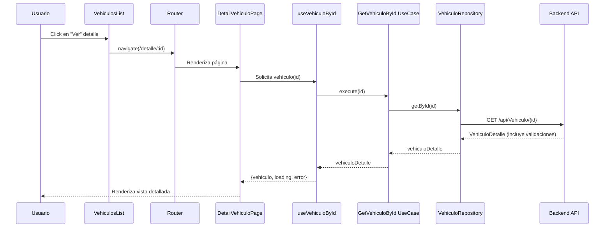
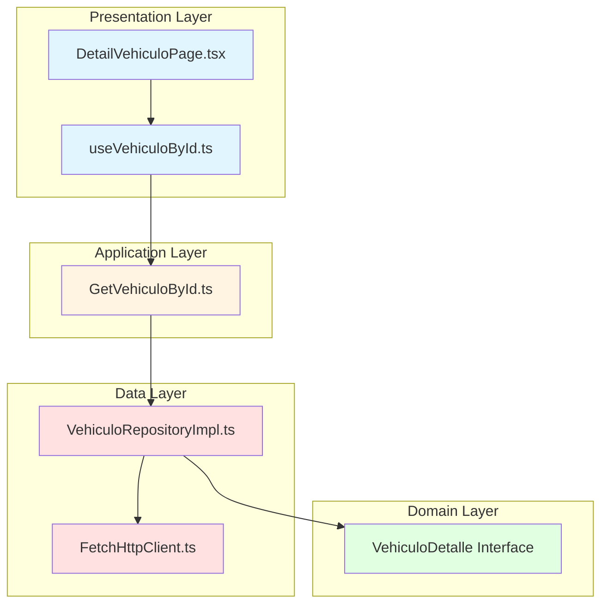
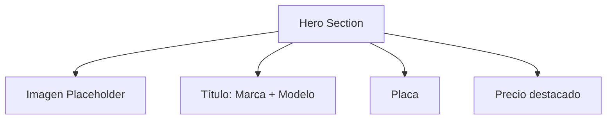
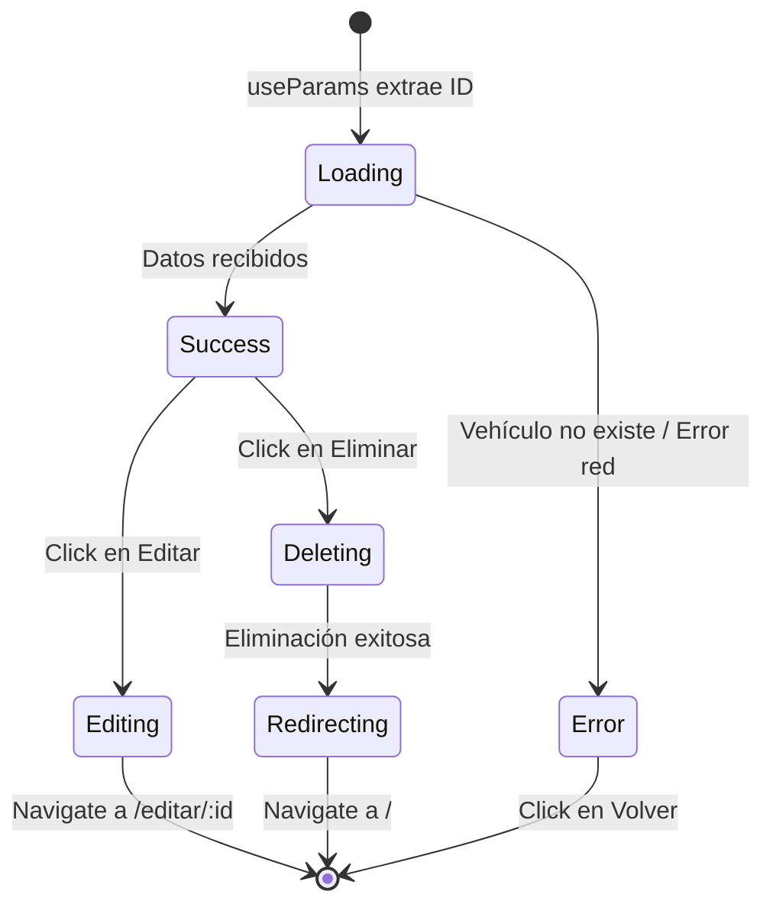

# Ver Detalle de Vehículo (GET by ID)

## Descripción General

Esta funcionalidad permite visualizar toda la información detallada de un vehículo específico, incluyendo validaciones de registro y revisión técnica, información del propietario, y acciones de edición/eliminación.

## Endpoint utilizado

```
GET https://localhost:7251/api/Vehiculo/{id}
```

## Flujo de la Operación



## Arquitectura en Capas



## Implementación por Capas

### 1. Capa de Dominio (Domain Layer)

**Archivo**: `domain/models/Vehiculo.ts`

```typescript
export interface VehiculoDetalle {
  id: string;
  placa: string;
  color: string;
  anio: number;
  precio: number;
  marca: string;
  modelo: string;
  correoPropietario: string;
  telefonoPropietario: string;
  // Campos adicionales del detalle
  registroValido: boolean;
  revisionValida: boolean;
}
```

**Diferencia con VehiculoResponse**:
- `VehiculoResponse`: Para listados (solo info básica)
- **`VehiculoDetalle`**: Para vista individual (incluye validaciones)

**Principio aplicado**:
- **ISP (Interface Segregation)**: Interfaces específicas según contexto de uso

### 2. Capa de Datos (Data Layer)

**Archivo**: `data/repositories/VehiculoRepositoryImpl.ts`

```typescript
import { VehiculoDetalle } from '../../domain/models/Vehiculo';
import { HttpClient } from '../http/HttpClient';
import { API_CONFIG } from '../../config/apiConfig';

export class VehiculoRepositoryImpl {
  constructor(private httpClient: HttpClient) {}

  async getById(id: string): Promise<VehiculoDetalle> {
    const url = `${API_CONFIG.BASE_URL}${API_CONFIG.ENDPOINTS.VEHICULOS}/${id}`;
    return await this.httpClient.get<VehiculoDetalle>(url);
  }
}
```

**Características**:
- Construye URL dinámica con el ID
- Tipado fuerte con `VehiculoDetalle`
- Manejo de errores delegado al HttpClient

### 3. Capa de Aplicación (Application Layer)

**Archivo**: `application/usecases/GetVehiculoById.ts`

```typescript
import { VehiculoDetalle } from '../../domain/models/Vehiculo';
import { VehiculoRepositoryImpl } from '../../data/repositories/VehiculoRepositoryImpl';

export class GetVehiculoById {
  constructor(private repository: VehiculoRepositoryImpl) {}

  async execute(id: string): Promise<VehiculoDetalle> {
    // Validar que el ID no esté vacío
    if (!id || id.trim() === '') {
      throw new Error('El ID del vehículo es requerido');
    }

    return await this.repository.getById(id);
  }
}
```

**Lógica de negocio**:
- Valida que el ID sea válido antes de consultar
- Podría agregar lógica adicional (caché, logging, etc.)

### 4. Capa de Presentación (Presentation Layer)

#### Custom Hook

**Archivo**: `presentation/hooks/useVehiculoById.ts`

```typescript
import { useState, useEffect, useMemo } from 'react';
import { VehiculoDetalle } from '../../domain/models/Vehiculo';
import { GetVehiculoById } from '../../application/usecases/GetVehiculoById';
import { VehiculoRepositoryImpl } from '../../data/repositories/VehiculoRepositoryImpl';
import { FetchHttpClient } from '../../data/http/FetchHttpClient';

export const useVehiculoById = (id: string) => {
  const [vehiculo, setVehiculo] = useState<VehiculoDetalle | null>(null);
  const [loading, setLoading] = useState(true);
  const [error, setError] = useState<string | null>(null);

  // Memoizar use case
  const getVehiculoByIdUseCase = useMemo(() => {
    const httpClient = new FetchHttpClient();
    const repository = new VehiculoRepositoryImpl(httpClient);
    return new GetVehiculoById(repository);
  }, []);

  useEffect(() => {
    const fetchVehiculo = async () => {
      try {
        setLoading(true);
        setError(null);
        console.log('useVehiculoById - Buscando ID:', id);
        
        const data = await getVehiculoByIdUseCase.execute(id);
        console.log('useVehiculoById - Datos recibidos:', data);
        
        setVehiculo(data);
      } catch (err) {
        console.error('useVehiculoById - Error:', err);
        setError('Error al cargar el vehículo');
      } finally {
        setLoading(false);
      }
    };

    if (id) {
      fetchVehiculo();
    }
  }, [id, getVehiculoByIdUseCase]);

  return { vehiculo, loading, error };
};
```

**Características**:
- Se ejecuta automáticamente cuando cambia el `id`
- Incluye logging para debugging
- Maneja estados de carga, error y datos

#### Página de Detalle

**Archivo**: `presentation/pages/DetailVehiculoPage.tsx`

```typescript
import { useParams, useNavigate } from 'react-router-dom';
import { useVehiculoById } from '../hooks/useVehiculoById';
import { useDeleteVehiculo } from '../hooks/useDeleteVehiculo';

export const DetailVehiculoPage = () => {
  const { id } = useParams<{ id: string }>();
  const navigate = useNavigate();
  const { vehiculo, loading, error } = useVehiculoById(id || '');
  const { deleteVehiculo, loading: deleting } = useDeleteVehiculo();

  const handleEdit = () => {
    navigate(`/editar/${id}`);
  };

  const handleDelete = async () => {
    if (window.confirm('¿Está seguro de eliminar este vehículo?')) {
      const success = await deleteVehiculo(id || '');
      if (success) {
        navigate('/');
      }
    }
  };

  // Estado de carga
  if (loading) {
    return (
      <div className="min-h-screen bg-gray-50 flex items-center justify-center">
        <div className="w-16 h-16 border-4 border-indigo-500/30 border-t-indigo-500 rounded-full animate-spin"></div>
      </div>
    );
  }

  // Estado de error
  if (error || !vehiculo) {
    return (
      <div className="min-h-screen bg-gray-50 flex items-center justify-center p-6">
        <div className="bg-red-50 border border-red-200 rounded-2xl p-8 max-w-md text-center">
          <h2 className="text-2xl font-bold text-red-600 mb-4">Error</h2>
          <p className="text-red-600">{error || 'Vehículo no encontrado'}</p>
          <button
            onClick={() => navigate('/')}
            className="mt-6 bg-red-600 text-white px-6 py-3 rounded-xl hover:bg-red-700 transition"
          >
            Volver a la lista
          </button>
        </div>
      </div>
    );
  }

  return (
    <section className="bg-gray-50 min-h-screen py-16 px-6">
      <div className="max-w-4xl mx-auto">
        {/* Hero Section con imagen y título */}
        <div className="bg-white rounded-2xl shadow-xl overflow-hidden mb-8">
          {/* Imagen placeholder */}
          <div className="bg-gradient-to-br from-indigo-500 to-purple-600 h-64 flex items-center justify-center">
            <svg className="w-32 h-32 text-white/80" fill="currentColor" viewBox="0 0 24 24">
              <path d="M18.92 6.01C18.72 5.42 18.16 5 17.5 5h-11c-.66 0-1.21.42-1.42 1.01L3 12v8c0 .55.45 1 1 1h1c.55 0 1-.45 1-1v-1h12v1c0 .55.45 1 1 1h1c.55 0 1-.45 1-1v-8l-2.08-5.99zM6.5 16c-.83 0-1.5-.67-1.5-1.5S5.67 13 6.5 13s1.5.67 1.5 1.5S7.33 16 6.5 16zm11 0c-.83 0-1.5-.67-1.5-1.5s.67-1.5 1.5-1.5 1.5.67 1.5 1.5-.67 1.5-1.5 1.5zM5 11l1.5-4.5h11L19 11H5z"/>
            </svg>
          </div>

          {/* Información principal */}
          <div className="p-8">
            <div className="flex flex-col md:flex-row md:items-center md:justify-between gap-4 mb-6">
              <div>
                <h1 className="text-4xl font-extrabold text-gray-900 mb-2">
                  {vehiculo.marca} {vehiculo.modelo}
                </h1>
                <p className="text-lg text-gray-600">Placa: {vehiculo.placa}</p>
              </div>
              <div className="text-right">
                <p className="text-sm text-gray-500 mb-1">Precio</p>
                <p className="text-4xl font-bold text-indigo-600">
                  ${vehiculo.precio.toLocaleString()}
                </p>
              </div>
            </div>

            {/* Badges de validación */}
            <div className="flex gap-3 mb-6">
              <span className={`px-4 py-2 rounded-full text-sm font-semibold ${
                vehiculo.registroValido 
                  ? 'bg-green-100 text-green-700' 
                  : 'bg-red-100 text-red-700'
              }`}>
                {vehiculo.registroValido ? '✓ Registro Válido' : '✗ Registro Inválido'}
              </span>
              <span className={`px-4 py-2 rounded-full text-sm font-semibold ${
                vehiculo.revisionValida 
                  ? 'bg-green-100 text-green-700' 
                  : 'bg-red-100 text-red-700'
              }`}>
                {vehiculo.revisionValida ? '✓ Revisión Válida' : '✗ Revisión Vencida'}
              </span>
            </div>

            {/* Grid de detalles */}
            <div className="grid grid-cols-1 md:grid-cols-2 gap-6 mb-8">
              <div className="bg-gray-50 rounded-xl p-4">
                <p className="text-sm text-gray-500 mb-1">Color</p>
                <p className="text-lg font-semibold text-gray-900">{vehiculo.color}</p>
              </div>
              <div className="bg-gray-50 rounded-xl p-4">
                <p className="text-sm text-gray-500 mb-1">Año</p>
                <p className="text-lg font-semibold text-gray-900">{vehiculo.anio}</p>
              </div>
            </div>

            {/* Información del propietario */}
            <div className="border-t border-gray-200 pt-6">
              <h3 className="text-xl font-bold text-gray-900 mb-4">
                Información del Propietario
              </h3>
              <div className="grid grid-cols-1 md:grid-cols-2 gap-6">
                <div className="flex items-center gap-3">
                  <div className="bg-indigo-100 p-3 rounded-xl">
                    <svg className="w-6 h-6 text-indigo-600" fill="none" stroke="currentColor" viewBox="0 0 24 24">
                      <path strokeLinecap="round" strokeLinejoin="round" strokeWidth="2" d="M3 8l7.89 5.26a2 2 0 002.22 0L21 8M5 19h14a2 2 0 002-2V7a2 2 0 00-2-2H5a2 2 0 00-2 2v10a2 2 0 002 2z" />
                    </svg>
                  </div>
                  <div>
                    <p className="text-sm text-gray-500">Correo Electrónico</p>
                    <p className="font-semibold text-gray-900">{vehiculo.correoPropietario}</p>
                  </div>
                </div>
                <div className="flex items-center gap-3">
                  <div className="bg-indigo-100 p-3 rounded-xl">
                    <svg className="w-6 h-6 text-indigo-600" fill="none" stroke="currentColor" viewBox="0 0 24 24">
                      <path strokeLinecap="round" strokeLinejoin="round" strokeWidth="2" d="M3 5a2 2 0 012-2h3.28a1 1 0 01.948.684l1.498 4.493a1 1 0 01-.502 1.21l-2.257 1.13a11.042 11.042 0 005.516 5.516l1.13-2.257a1 1 0 011.21-.502l4.493 1.498a1 1 0 01.684.949V19a2 2 0 01-2 2h-1C9.716 21 3 14.284 3 6V5z" />
                    </svg>
                  </div>
                  <div>
                    <p className="text-sm text-gray-500">Teléfono</p>
                    <p className="font-semibold text-gray-900">{vehiculo.telefonoPropietario}</p>
                  </div>
                </div>
              </div>
            </div>

            {/* Botones de acción */}
            <div className="flex gap-4 mt-8">
              <button
                onClick={handleEdit}
                disabled={deleting}
                className="flex-1 bg-gradient-to-br from-indigo-500 to-purple-600 text-white px-6 py-3 rounded-xl hover:shadow-[0_10px_20px_rgba(99,102,241,0.3)] hover:-translate-y-0.5 transition-all font-semibold disabled:opacity-50 disabled:cursor-not-allowed"
              >
                Editar Vehículo
              </button>
              <button
                onClick={handleDelete}
                disabled={deleting}
                className="flex-1 bg-red-600 text-white px-6 py-3 rounded-xl hover:shadow-[0_10px_20px_rgba(220,38,38,0.3)] hover:-translate-y-0.5 transition-all font-semibold disabled:opacity-50 disabled:cursor-not-allowed"
              >
                {deleting ? 'Eliminando...' : 'Eliminar Vehículo'}
              </button>
              <button
                onClick={() => navigate('/')}
                disabled={deleting}
                className="bg-gray-100 text-gray-700 px-6 py-3 rounded-xl hover:bg-gray-200 transition font-semibold disabled:opacity-50 disabled:cursor-not-allowed"
              >
                Volver
              </button>
            </div>
          </div>
        </div>
      </div>
    </section>
  );
};
```

## Componentes Principales de la Vista

### 1. Hero Section


### 2. Badges de Validación

```typescript
<span className={
  vehiculo.registroValido 
    ? 'bg-green-100 text-green-700' 
    : 'bg-red-100 text-red-700'
}>
  {vehiculo.registroValido ? '✓ Registro Válido' : '✗ Registro Inválido'}
</span>
```

**Visualización dinámica**:
- Verde si válido, rojo si inválido
- Íconos visuales (✓/✗)
- Diseño tipo badge redondeado

### 3. Grid de Detalles

Información organizada en tarjetas:
- Color del vehículo
- Año de fabricación

### 4. Información del Propietario

Con iconografía:
- Email con ícono de sobre
- Teléfono con ícono de teléfono
- Fondo indigo para consistencia visual

## Flujo de Estados



## Extracción del ID desde la URL

```typescript
import { useParams } from 'react-router-dom';

const { id } = useParams<{ id: string }>();
```

**React Router proporciona**:
- Hook `useParams` para extraer parámetros de ruta
- Tipado con TypeScript para seguridad
- Actualización automática si cambia el ID

## Manejo de Casos Límite

### 1. ID Inválido o No Existente

```typescript
if (error || !vehiculo) {
  return (
    <div className="bg-red-50 border border-red-200 rounded-2xl p-8">
      <h2 className="text-2xl font-bold text-red-600">Error</h2>
      <p>{error || 'Vehículo no encontrado'}</p>
      <button onClick={() => navigate('/')}>
        Volver a la lista
      </button>
    </div>
  );
}
```

### 2. Estado de Carga

```typescript
if (loading) {
  return (
    <div className="min-h-screen flex items-center justify-center">
      <div className="w-16 h-16 border-4 border-indigo-500/30 border-t-indigo-500 rounded-full animate-spin"></div>
    </div>
  );
}
```

### 3. Eliminación en Progreso

```typescript
<button disabled={deleting}>
  {deleting ? 'Eliminando...' : 'Eliminar Vehículo'}
</button>
```

## Principios SOLID Aplicados

### 1. Single Responsibility (SRP)

Cada elemento tiene una responsabilidad única:
- **useVehiculoById**: Solo maneja estado de carga del vehículo
- **DetailVehiculoPage**: Solo renderiza la vista detallada
- **GetVehiculoById**: Solo contiene lógica de obtener un vehículo

### 2. Interface Segregation (ISP)

```typescript
// Interface específica para detalle (incluye validaciones)
interface VehiculoDetalle extends VehiculoBase {
  id: string;
  marca: string;
  modelo: string;
  registroValido: boolean;  // Específico del detalle
  revisionValida: boolean;  // Específico del detalle
}
```

### 3. Dependency Inversion (DIP)

```typescript
// DetailVehiculoPage no depende de implementación concreta
const { vehiculo, loading, error } = useVehiculoById(id || '');
```

## Ventajas de esta Implementación

### 1. UX Rica
- Vista completa de toda la información
- Validaciones visuales claras
- Acciones rápidas (editar, eliminar)

### 2. Navegación Intuitiva
- Botón "Volver" siempre visible
- Breadcrumbs implícitos con navegación
- URLs semánticas (`/detalle/:id`)

### 3. Diseño Responsive
- Grid adaptable a móvil
- Flex direction cambia según viewport
- Imágenes y badges responsivos

### 4. Manejo de Errores Robusto
- Validación de ID antes de consultar
- Estados de error claros
- Mensajes informativos al usuario

## Diferencias entre GET all vs GET by ID

| Aspecto | GET all (Lista) | GET by ID (Detalle) |
|---------|----------------|---------------------|
| **Endpoint** | `/api/Vehiculo` | `/api/Vehiculo/{id}` |
| **Response** | `VehiculoResponse[]` | `VehiculoDetalle` |
| **Datos extras** | - | `registroValido`, `revisionValida` |
| **Uso** | Listado general | Vista individual |
| **Optimización** | Campos mínimos | Información completa |

```mermaid
graph LR
    A[Usuario] -->|Browse| B[GET all - Lista]
    A -->|Select| C[GET by ID - Detalle]
    B -->|menos datos| D[VehiculoResponse[]]
    C -->|más datos| E[VehiculoDetalle]
    
    style B fill:#e1f5ff
    style C fill:#fff4e1
    style D fill:#e1ffe1
    style E fill:#ffe1e1
```

## Posibles Mejoras Futuras

1. **Galería de imágenes**: Múltiples fotos del vehículo
2. **Historial**: Cambios de precio, reparaciones
3. **Documentos**: Visualizar PDFs de registro, revisión
4. **Compartir**: Link directo a detalle, QR code
5. **Breadcrumbs**: Navegación jerárquica visible
6. **Tabs**: Organizar info en pestañas (Datos, Propietario, Historial)

---

**Anterior**: [Crear Vehículo (POST)](./02-post-crear-vehiculo.md)  
**Siguiente**: [Editar Vehículo (PUT)](./04-put-editar-vehiculo.md)
