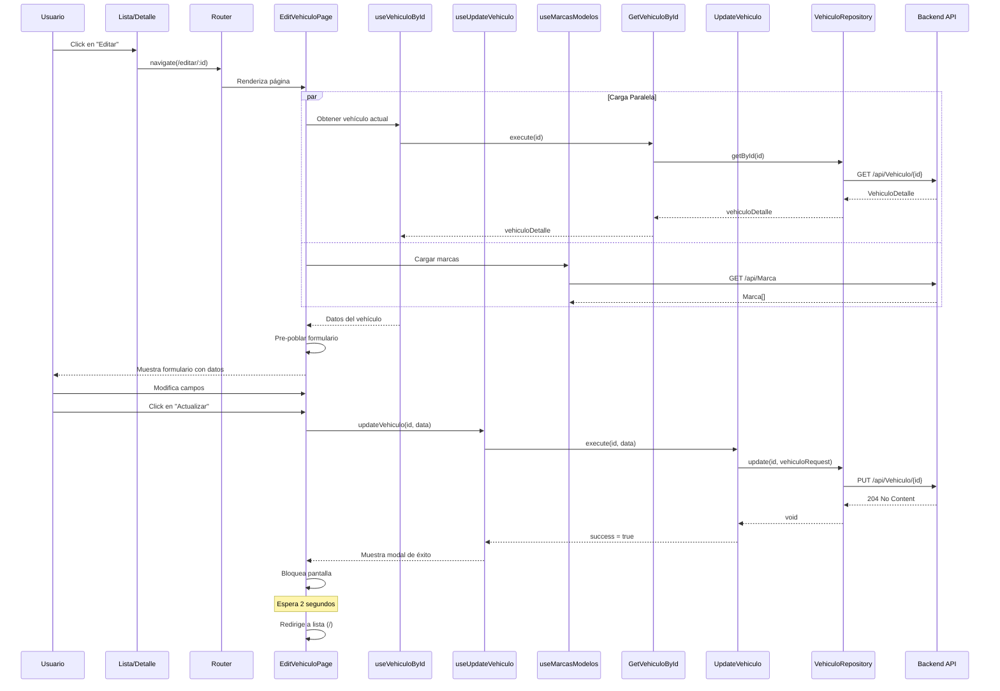
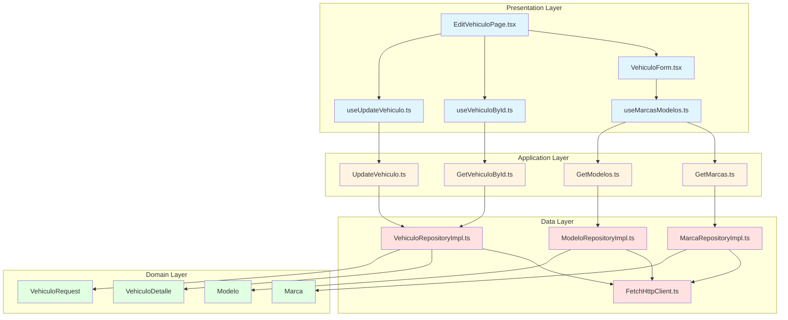
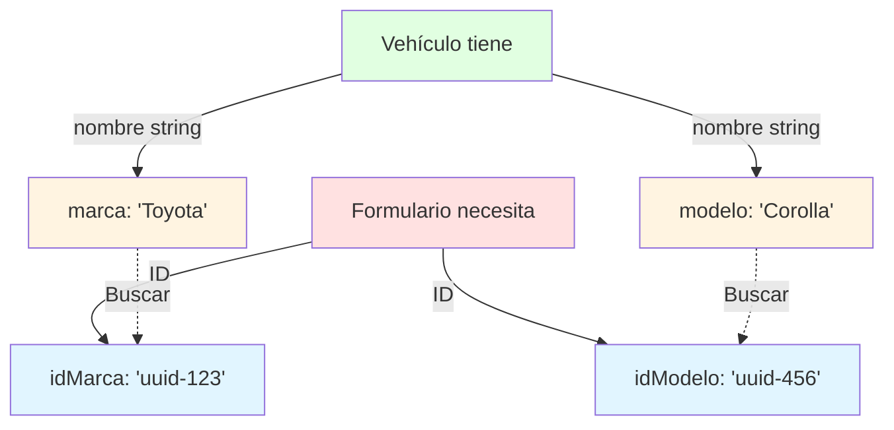
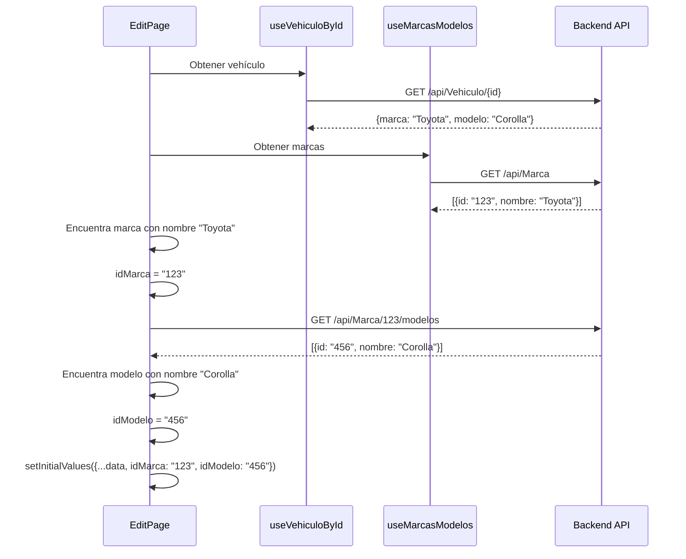
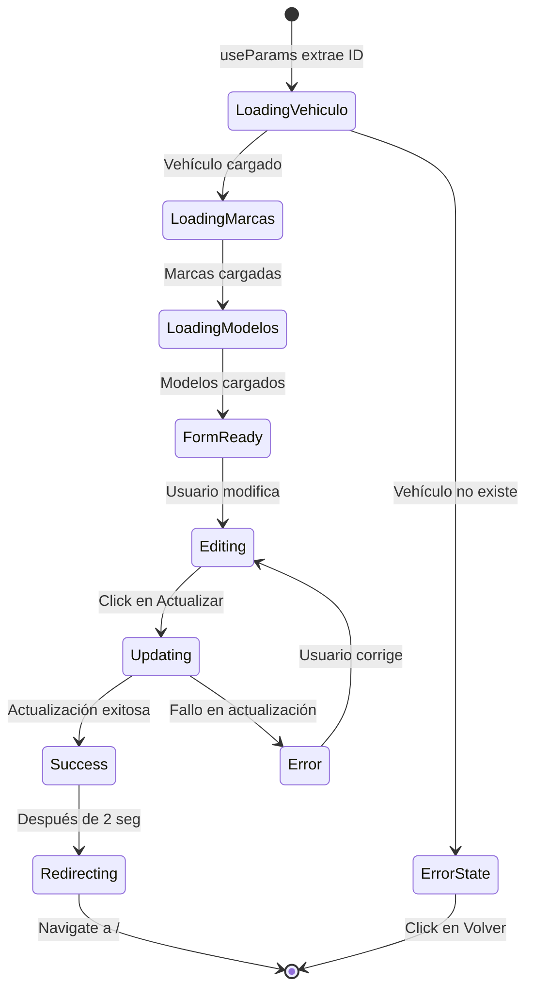

# Editar Vehículo (PUT)

## Descripción General

Esta funcionalidad permite modificar los datos de un vehículo existente. El usuario accede a un formulario pre-poblado con los datos actuales, realiza los cambios necesarios, y envía la actualización al backend.

## Endpoint utilizado

```
PUT https://localhost:7251/api/Vehiculo/{id}
Content-Type: application/json
```

## Flujo de la Operación



## Arquitectura en Capas



## Implementación por Capas

### 1. Capa de Dominio (Domain Layer)

**Mismo modelo que POST**:

```typescript
export interface VehiculoRequest extends VehiculoBase {
  idMarca: string;
  idModelo: string;
}
```

**Nota importante**: 
- El ID **NO** va en el body, va en la URL
- El backend identifica el vehículo por el ID de la ruta

### 2. Capa de Datos (Data Layer)

#### Manejo de 204 No Content

**Archivo**: `data/http/FetchHttpClient.ts`

```typescript
export class FetchHttpClient implements HttpClient {
  async put<T>(url: string, data: unknown): Promise<T> {
    const response = await fetch(url, {
      method: 'PUT',
      headers: {
        'Content-Type': 'application/json',
      },
      body: JSON.stringify(data),
    });

    if (!response.ok) {
      throw new Error(`HTTP Error: ${response.status}`);
    }

    // PUT típicamente retorna 204 No Content
    if (response.status === 204) {
      return {} as T;
    }

    return await response.json();
  }
}
```

**Manejo especial**:
- `204 No Content` es éxito sin respuesta
- No intentar parsear JSON de respuesta vacía
- Retornar objeto vacío

#### Repository Implementation

**Archivo**: `data/repositories/VehiculoRepositoryImpl.ts`

```typescript
import { VehiculoRequest } from '../../domain/models/Vehiculo';
import { HttpClient } from '../http/HttpClient';
import { API_CONFIG } from '../../config/apiConfig';

export class VehiculoRepositoryImpl {
  constructor(private httpClient: HttpClient) {}

  async update(id: string, vehiculo: VehiculoRequest): Promise<void> {
    const url = `${API_CONFIG.BASE_URL}${API_CONFIG.ENDPOINTS.VEHICULOS}/${id}`;
    await this.httpClient.put<void>(url, vehiculo);
  }
}
```

**Características**:
- Retorna `void` porque PUT no devuelve datos
- Construye URL con ID dinámicamente

### 3. Capa de Aplicación (Application Layer)

**Archivo**: `application/usecases/UpdateVehiculo.ts`

```typescript
import { VehiculoRequest } from '../../domain/models/Vehiculo';
import { VehiculoRepositoryImpl } from '../../data/repositories/VehiculoRepositoryImpl';

export class UpdateVehiculo {
  constructor(private repository: VehiculoRepositoryImpl) {}

  async execute(id: string, vehiculo: VehiculoRequest): Promise<void> {
    // Validaciones de negocio
    if (!id || id.trim() === '') {
      throw new Error('El ID del vehículo es requerido');
    }

    if (vehiculo.precio <= 0) {
      throw new Error('El precio debe ser mayor a 0');
    }

    if (vehiculo.anio < 1900 || vehiculo.anio > new Date().getFullYear() + 1) {
      throw new Error('El año es inválido');
    }

    await this.repository.update(id, vehiculo);
  }
}
```

**Validaciones**:
- Valida que el ID exista
- Mismas validaciones de negocio que CREATE
- Podría agregar validación de cambios (si nada cambió, no actualizar)

### 4. Capa de Presentación (Presentation Layer)

#### Hook de Actualización

**Archivo**: `presentation/hooks/useUpdateVehiculo.ts`

```typescript
import { useState, useMemo, useCallback } from 'react';
import { VehiculoRequest } from '../../domain/models/Vehiculo';
import { UpdateVehiculo } from '../../application/usecases/UpdateVehiculo';
import { VehiculoRepositoryImpl } from '../../data/repositories/VehiculoRepositoryImpl';
import { FetchHttpClient } from '../../data/http/FetchHttpClient';

export const useUpdateVehiculo = () => {
  const [loading, setLoading] = useState(false);
  const [error, setError] = useState<string | null>(null);
  const [success, setSuccess] = useState(false);

  // Memoizar instancias
  const updateVehiculoUseCase = useMemo(() => {
    const httpClient = new FetchHttpClient();
    const repository = new VehiculoRepositoryImpl(httpClient);
    return new UpdateVehiculo(repository);
  }, []);

  const updateVehiculo = useCallback(async (
    id: string, 
    vehiculo: VehiculoRequest
  ): Promise<boolean> => {
    try {
      setLoading(true);
      setError(null);
      setSuccess(false);
      console.log('useUpdateVehiculo - ID:', id, 'Data:', vehiculo);
      
      await updateVehiculoUseCase.execute(id, vehiculo);
      
      console.log('useUpdateVehiculo - Success');
      setSuccess(true);
      return true;
    } catch (err) {
      console.error('useUpdateVehiculo - Error:', err);
      setError(err instanceof Error ? err.message : 'Error al actualizar el vehículo');
      return false;
    } finally {
      setLoading(false);
    }
  }, [updateVehiculoUseCase]);

  return { updateVehiculo, loading, error, success };
};
```

**Diferencia con useCreateVehiculo**:
- Recibe **dos parámetros**: `id` y `vehiculo`
- Misma estructura de estados y retornos

#### Página de Edición

**Archivo**: `presentation/pages/EditVehiculoPage.tsx`

```typescript
import { useParams, useNavigate } from 'react-router-dom';
import { useVehiculoById } from '../hooks/useVehiculoById';
import { useUpdateVehiculo } from '../hooks/useUpdateVehiculo';
import { useMarcasModelos } from '../hooks/useMarcasModelos';
import { VehiculoForm } from '../components/VehiculoForm';
import { VehiculoRequest } from '../../domain/models/Vehiculo';
import { useEffect, useState } from 'react';

export const EditVehiculoPage = () => {
  const { id } = useParams<{ id: string }>();
  const navigate = useNavigate();
  const { vehiculo, loading: loadingVehiculo, error: errorVehiculo } = useVehiculoById(id || '');
  const { updateVehiculo, loading: updating, error: errorUpdate, success } = useUpdateVehiculo();
  const { marcas } = useMarcasModelos();
  const [initialValues, setInitialValues] = useState<any>(null);

  console.log('EditVehiculoPage - ID recibido:', id);

  // Preparar valores iniciales cuando se carga el vehículo y las marcas
  useEffect(() => {
    if (vehiculo && marcas.length > 0) {
      // Encontrar la marca por nombre para obtener su ID
      const marca = marcas.find(m => m.nombre === vehiculo.marca);
      
      if (marca) {
        // Cargar modelos de esa marca
        const fetchModelos = async () => {
          try {
            const responseModelos = await fetch(
              `https://localhost:7251/api/Marca/${marca.id}/modelos`
            );

            if (responseModelos.status === 204) {
              console.log('No hay modelos para esta marca');
              return;
            }

            if (!responseModelos.ok) {
              throw new Error('Error al cargar modelos');
            }

            const modelosData = await responseModelos.json();
            const modelo = modelosData.find((m: any) => m.nombre === vehiculo.modelo);

            // Establecer valores iniciales con los IDs correctos
            setInitialValues({
              placa: vehiculo.placa,
              color: vehiculo.color,
              anio: vehiculo.anio,
              precio: vehiculo.precio,
              correoPropietario: vehiculo.correoPropietario,
              telefonoPropietario: vehiculo.telefonoPropietario,
              idMarca: marca.id,
              idModelo: modelo?.id || '',
            });
          } catch (error) {
            console.error('Error loading modelos:', error);
          }
        };

        fetchModelos();
      }
    }
  }, [vehiculo, marcas]);

  // Redirigir después de actualizar exitosamente
  useEffect(() => {
    if (success) {
      setTimeout(() => {
        navigate('/');
      }, 2000);
    }
  }, [success, navigate]);

  const handleSubmit = async (data: VehiculoRequest) => {
    if (id) {
      await updateVehiculo(id, data);
    }
  };

  // Estado de carga
  if (loadingVehiculo) {
    return (
      <div className="min-h-screen bg-gray-50 flex items-center justify-center">
        <div className="w-16 h-16 border-4 border-indigo-500/30 border-t-indigo-500 rounded-full animate-spin"></div>
      </div>
    );
  }

  // Estado de error
  if (errorVehiculo || !vehiculo) {
    return (
      <div className="min-h-screen bg-gray-50 flex items-center justify-center p-6">
        <div className="bg-red-50 border border-red-200 rounded-2xl p-8 max-w-md text-center">
          <h2 className="text-2xl font-bold text-red-600 mb-4">Error</h2>
          <p className="text-red-600">{errorVehiculo || 'Vehículo no encontrado'}</p>
          <button
            onClick={() => navigate('/')}
            className="mt-6 bg-red-600 text-white px-6 py-3 rounded-xl hover:bg-red-700 transition"
          >
            Volver a la lista
          </button>
        </div>
      </div>
    );
  }

  return (
    <section className="relative bg-gray-50 min-h-screen py-16 px-6">
      <div className="max-w-4xl mx-auto">
        {/* Header */}
        <div className="text-center mb-10">
          <h1 className="text-4xl font-extrabold text-gray-900 mb-4">
            Editar Vehículo
          </h1>
          <p className="text-gray-600">
            Modifique los campos necesarios y guarde los cambios
          </p>
        </div>

        {/* Formulario */}
        <div className="bg-white rounded-2xl shadow-xl p-8 md:p-12">
          {errorUpdate && (
            <div className="mb-6 bg-red-50 border border-red-200 rounded-xl p-4">
              <p className="text-red-600 font-semibold">{errorUpdate}</p>
            </div>
          )}

          {initialValues ? (
            <VehiculoForm 
              initialValues={initialValues}
              onSubmit={handleSubmit} 
              loading={updating || success}
              submitLabel="Actualizar Vehículo"
            />
          ) : (
            <div className="flex justify-center py-8">
              <div className="w-12 h-12 border-4 border-indigo-500/30 border-t-indigo-500 rounded-full animate-spin"></div>
            </div>
          )}

          {/* Botón Cancelar */}
          <button
            onClick={() => navigate('/')}
            disabled={updating || success}
            className="mt-4 w-full bg-gray-100 text-gray-700 px-6 py-3 rounded-xl hover:bg-gray-200 transition font-semibold disabled:opacity-50 disabled:cursor-not-allowed"
          >
            Cancelar
          </button>
        </div>
      </div>

      {/* Modal de Éxito con Bloqueo de Pantalla */}
      {success && (
        <div className="absolute inset-0 bg-black/50 backdrop-blur-sm z-50 flex items-center justify-center">
          <div className="bg-white rounded-2xl shadow-2xl p-8 max-w-md mx-4 text-center">
            <div className="w-16 h-16 bg-green-100 rounded-full flex items-center justify-center mx-auto mb-4">
              <svg className="w-8 h-8 text-green-600" fill="none" stroke="currentColor" viewBox="0 0 24 24">
                <path strokeLinecap="round" strokeLinejoin="round" strokeWidth="2" d="M5 13l4 4L19 7" />
              </svg>
            </div>
            <h3 className="text-2xl font-bold text-gray-900 mb-2">
              ¡Vehículo Actualizado!
            </h3>
            <p className="text-gray-600">
              Redirigiendo a la lista...
            </p>
            <div className="mt-4 w-16 h-16 border-4 border-indigo-500/30 border-t-indigo-500 rounded-full animate-spin mx-auto"></div>
          </div>
        </div>
      )}
    </section>
  );
};
```

## Desafío Principal: Pre-poblar Marca y Modelo

### El Problema



### La Solución

```typescript
// 1. Cargar todas las marcas
const { marcas } = useMarcasModelos();

// 2. Buscar la marca por nombre
const marca = marcas.find(m => m.nombre === vehiculo.marca);

// 3. Cargar modelos de esa marca específica
const responseModelos = await fetch(
  `https://localhost:7251/api/Marca/${marca.id}/modelos`
);

// 4. Buscar el modelo por nombre
const modelosData = await responseModelos.json();
const modelo = modelosData.find((m: any) => m.nombre === vehiculo.modelo);

// 5. Establecer valores con IDs
setInitialValues({
  ...vehiculo,
  idMarca: marca.id,
  idModelo: modelo?.id || '',
});
```

### Flujo de Pre-población



## Reutilización del VehiculoForm

El componente `VehiculoForm` se reutiliza para **crear** y **editar**:

### Al Crear (sin initialValues)
```typescript
<VehiculoForm 
  onSubmit={handleCreate} 
  loading={loading}
  submitLabel="Crear Vehículo"
/>
```

### Al Editar (con initialValues)
```typescript
<VehiculoForm 
  initialValues={vehiculoData}
  onSubmit={handleUpdate} 
  loading={loading}
  submitLabel="Actualizar Vehículo"
/>
```

**Ventaja del principio OCP (Open/Closed)**:
- Sin modificar el componente, funciona para ambos casos
- Extensible mediante props

## Flujo de Estados



## Diferencias entre POST (Create) y PUT (Update)

| Aspecto | POST (Create) | PUT (Update) |
|---------|--------------|--------------|
| **Endpoint** | `/api/Vehiculo` | `/api/Vehiculo/{id}` |
| **ID** | No existe, se genera | Existe, va en URL |
| **Formulario** | Vacío | Pre-poblado |
| **Response** | 201 + Location header | 204 No Content |
| **Hook** | `useCreateVehiculo()` | `useUpdateVehiculo(id, data)` |
| **Carga inicial** | No necesita | Fetch vehículo actual |

## Principios SOLID Aplicados

### 1. Single Responsibility (SRP)

Cada componente tiene una única responsabilidad:
- **EditVehiculoPage**: Coordinar la edición (cargar datos, submit)
- **VehiculoForm**: Solo renderizar y capturar
- **useUpdateVehiculo**: Solo gestionar estado de actualización
- **UpdateVehiculo (UseCase)**: Solo lógica de negocio

### 2. Open/Closed (OCP)

```typescript
// VehiculoForm se reutiliza sin modificación
interface Props {
  initialValues?: VehiculoBase & { idMarca?: string; idModelo?: string };
  // ...
}
```

### 3. Liskov Substitution (LSP)

```typescript
// CreateVehiculo y UpdateVehiculo comparten estructura
class CreateVehiculo {
  async execute(vehiculo: VehiculoRequest): Promise<string> { }
}

class UpdateVehiculo {
  async execute(id: string, vehiculo: VehiculoRequest): Promise<void> { }
}
```

### 4. Dependency Inversion (DIP)

```typescript
// Depende de abstracciones
const updateVehiculoUseCase = new UpdateVehiculo(repository);
```

## Ventajas de esta Implementación

### 1. Máxima Reutilización
- Un solo formulario para crear y editar
- Hooks específicos pero con estructura similar

### 2. UX Mejorada
- Formulario pre-poblado con datos actuales
- Usuario solo modifica lo necesario
- Validaciones coherentes con creación

### 3. Manejo Robusto de Datos
- Conversión nombre → ID automática
- Carga en cascada (vehículo → marcas → modelos)
- Validación de datos existentes

### 4. Estados Claros
- Loading separado para cada fase
- Errores específicos
- Modal de éxito con bloqueo

## Casos Límite Manejados

### 1. Vehículo No Existe
```typescript
if (errorVehiculo || !vehiculo) {
  return <ErrorScreen />;
}
```

### 2. Marca/Modelo No Encontrados
```typescript
const marca = marcas.find(m => m.nombre === vehiculo.marca);
if (!marca) {
  // Manejar caso
}
```

### 3. API Retorna 204 (Sin Modelos)
```typescript
if (responseModelos.status === 204) {
  console.log('No hay modelos para esta marca');
  return;
}
```

### 4. Usuario Navega Durante Actualización
```typescript
disabled={updating || success}
```

## Posibles Mejoras Futuras

1. **Detección de cambios**: Solo enviar si hay modificaciones
2. **Confirmación de salida**: Advertir si hay cambios sin guardar
3. **Histórico**: Mostrar cambios anteriores
4. **Validación en tiempo real**: Feedback mientras edita
5. **Modo borrador**: Guardar cambios temporales sin commitear
6. **Undo/Redo**: Deshacer cambios en el formulario

---

**Anterior**: [Ver Detalle Vehículo (GET by ID)](./03-get-detalle-vehiculo.md)  
**Siguiente**: [Eliminar Vehículo (DELETE)](./05-delete-eliminar-vehiculo.md)
