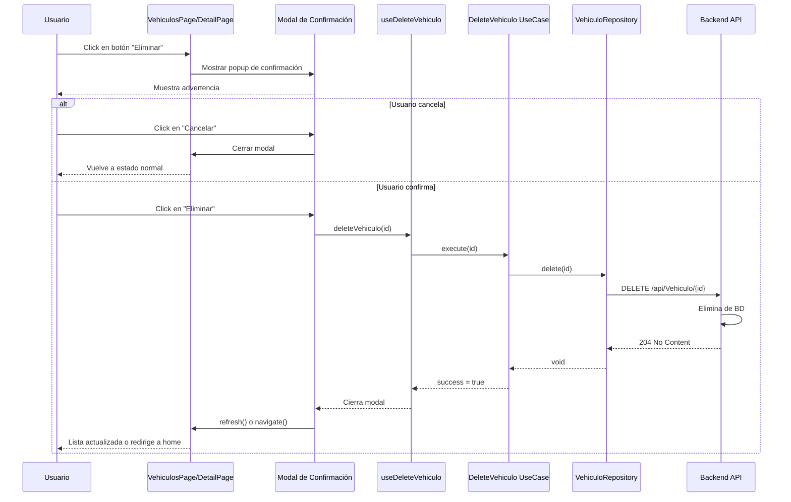
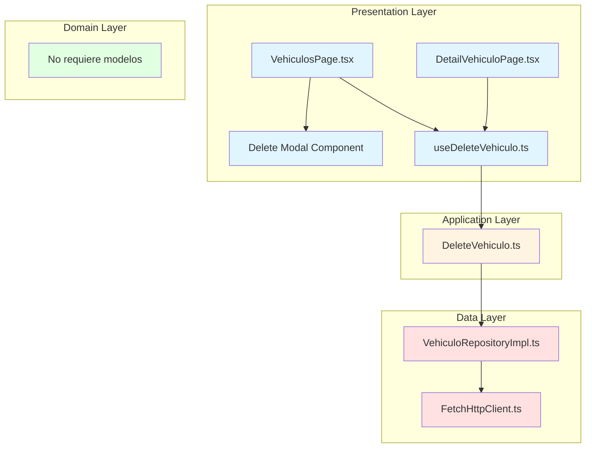
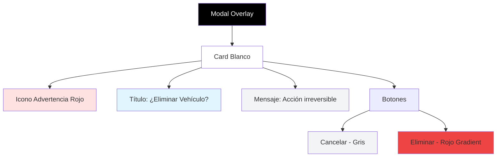
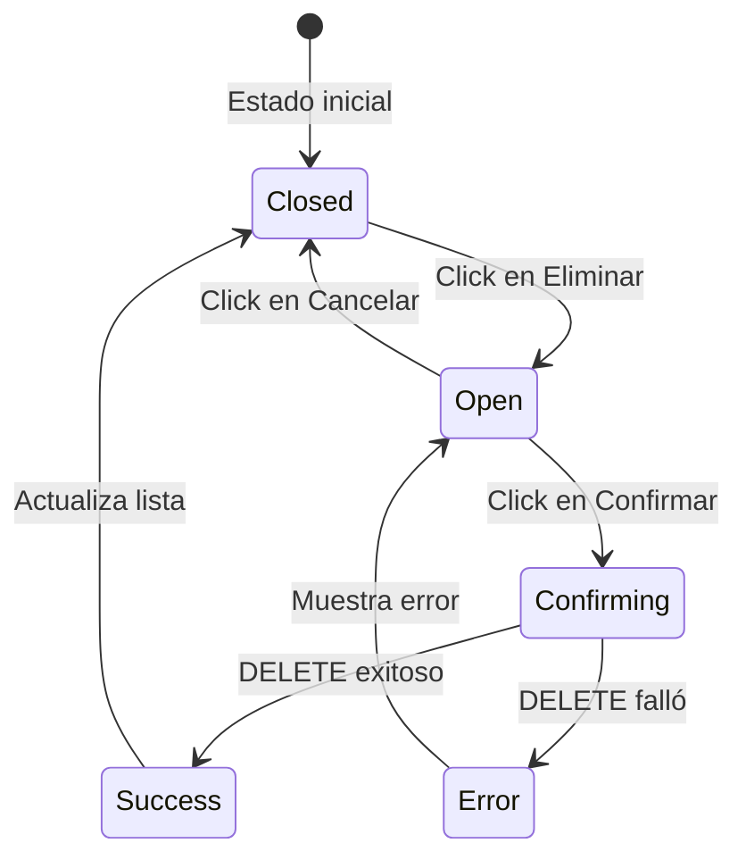
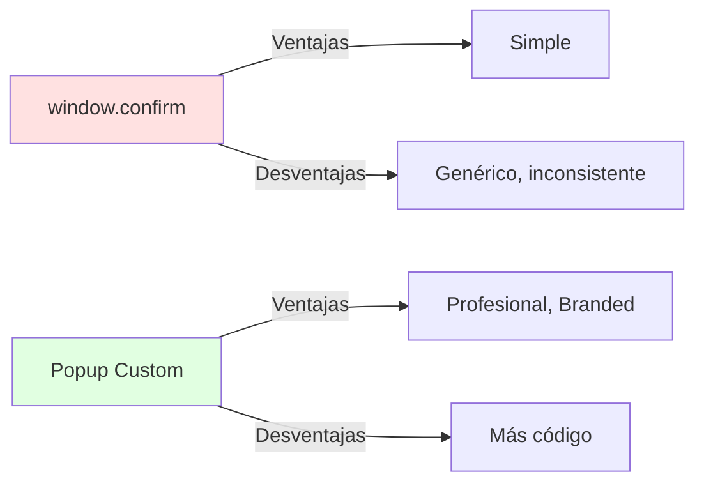
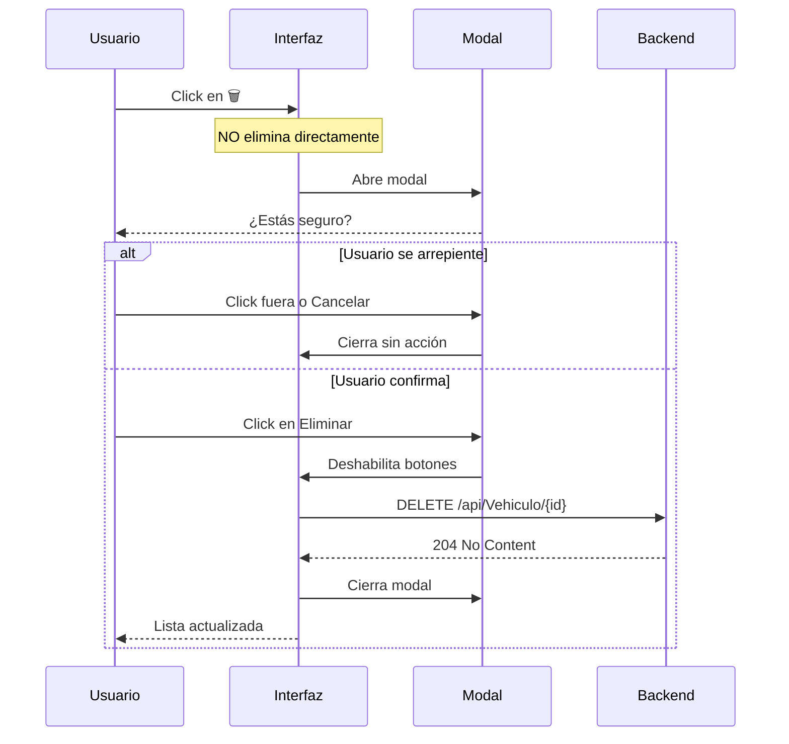
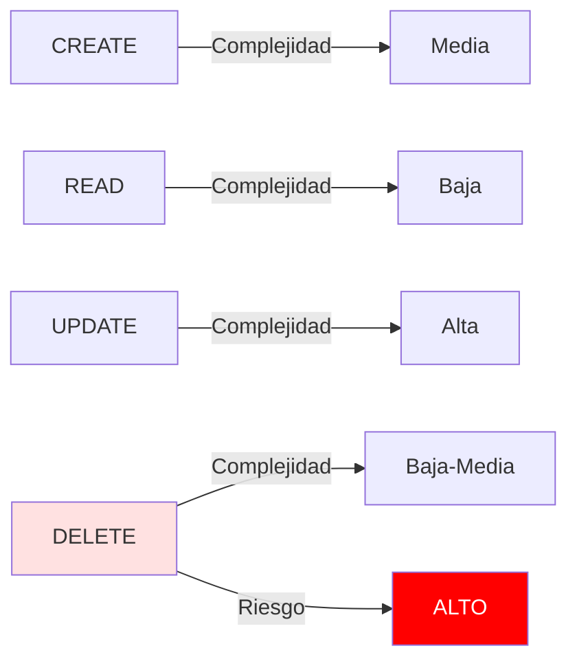

# Eliminar Vehículo (DELETE)

## Descripción General

Esta funcionalidad permite eliminar un vehículo del sistema de forma permanente. El usuario puede eliminar desde dos lugares: la lista principal o la página de detalle. Se muestra un popup de confirmación personalizado para prevenir eliminaciones accidentales.

## Endpoint utilizado

```
DELETE https://localhost:7251/api/Vehiculo/{id}
```

## Flujo de la Operación



## Arquitectura en Capas



## Implementación por Capas

### 1. Capa de Dominio (Domain Layer)

**No requiere modelos específicos** porque DELETE solo necesita el ID y no retorna datos.

```typescript
// Solo necesitamos el ID (tipo primitivo)
type VehiculoId = string;
```

### 2. Capa de Datos (Data Layer)

#### HttpClient DELETE

**Archivo**: `data/http/FetchHttpClient.ts`

```typescript
export class FetchHttpClient implements HttpClient {
  async delete(url: string): Promise<void> {
    const response = await fetch(url, {
      method: 'DELETE',
      headers: {
        'Content-Type': 'application/json',
      },
    });

    if (!response.ok) {
      throw new Error(`HTTP Error: ${response.status}`);
    }

    // DELETE típicamente retorna 204 No Content
    // No hay body que procesar
  }
}
```

**Características**:
- Retorna `void` (no hay datos de respuesta)
- No intenta parsear JSON
- Solo valida que `response.ok` sea true

#### Repository Implementation

**Archivo**: `data/repositories/VehiculoRepositoryImpl.ts`

```typescript
import { HttpClient } from '../http/HttpClient';
import { API_CONFIG } from '../../config/apiConfig';

export class VehiculoRepositoryImpl {
  constructor(private httpClient: HttpClient) {}

  async delete(id: string): Promise<void> {
    const url = `${API_CONFIG.BASE_URL}${API_CONFIG.ENDPOINTS.VEHICULOS}/${id}`;
    await this.httpClient.delete(url);
  }
}
```

**Principio aplicado**:
- **SRP**: Solo se encarga de comunicarse con el API

### 3. Capa de Aplicación (Application Layer)

**Archivo**: `application/usecases/DeleteVehiculo.ts`

```typescript
import { VehiculoRepositoryImpl } from '../../data/repositories/VehiculoRepositoryImpl';

export class DeleteVehiculo {
  constructor(private repository: VehiculoRepositoryImpl) {}

  async execute(id: string): Promise<void> {
    // Validación de negocio
    if (!id || id.trim() === '') {
      throw new Error('El ID del vehículo es requerido');
    }

    // Aquí se podrían agregar validaciones adicionales:
    // - Verificar que no tenga dependencias
    // - Soft delete vs hard delete
    // - Auditoría/logging

    await this.repository.delete(id);
  }
}
```

**Lógica de negocio potencial**:
- Validar permisos del usuario
- Verificar si tiene datos relacionados
- Implementar soft delete (marcar como eliminado sin borrar)
- Logging de auditoría

### 4. Capa de Presentación (Presentation Layer)

#### Custom Hook

**Archivo**: `presentation/hooks/useDeleteVehiculo.ts`

```typescript
import { useState, useMemo, useCallback } from 'react';
import { DeleteVehiculo } from '../../application/usecases/DeleteVehiculo';
import { VehiculoRepositoryImpl } from '../../data/repositories/VehiculoRepositoryImpl';
import { FetchHttpClient } from '../../data/http/FetchHttpClient';

export const useDeleteVehiculo = () => {
  const [loading, setLoading] = useState(false);
  const [error, setError] = useState<string | null>(null);

  // Memoizar instancias
  const deleteVehiculoUseCase = useMemo(() => {
    const httpClient = new FetchHttpClient();
    const repository = new VehiculoRepositoryImpl(httpClient);
    return new DeleteVehiculo(repository);
  }, []);

  const deleteVehiculo = useCallback(async (id: string): Promise<boolean> => {
    try {
      setLoading(true);
      setError(null);
      
      await deleteVehiculoUseCase.execute(id);
      
      return true;
    } catch (err) {
      setError(err instanceof Error ? err.message : 'Error al eliminar el vehículo');
      console.error('Error deleting vehiculo:', err);
      return false;
    } finally {
      setLoading(false);
    }
  }, [deleteVehiculoUseCase]);

  return { deleteVehiculo, loading, error };
};
```

**Características**:
- Retorna `boolean` para indicar éxito/fallo
- Estados simples: `loading` y `error`
- No necesita `success` porque se maneja con el boolean de retorno

#### Modal de Confirmación (Popup Personalizado)

**Implementado en**: `presentation/pages/VehiculosPage.tsx`

```typescript
export const VehiculosPage = () => {
  const { vehiculos, loading, error, refresh } = useVehiculos();
  const { deleteVehiculo, loading: deleting } = useDeleteVehiculo();
  const [showDeleteModal, setShowDeleteModal] = useState(false);
  const [vehiculoToDelete, setVehiculoToDelete] = useState<string | null>(null);

  const handleDelete = (id: string) => {
    setVehiculoToDelete(id);
    setShowDeleteModal(true);
  };

  const confirmDelete = async () => {
    if (vehiculoToDelete) {
      const success = await deleteVehiculo(vehiculoToDelete);
      if (success) {
        refresh(); // Actualizar la lista
      }
      setShowDeleteModal(false);
      setVehiculoToDelete(null);
    }
  };

  const cancelDelete = () => {
    setShowDeleteModal(false);
    setVehiculoToDelete(null);
  };

  return (
    <section>
      {/* Lista de vehículos */}
      <VehiculoList 
        vehiculos={paginatedItems}
        onDelete={handleDelete}
        // ...
      />

      {/* Modal de Confirmación */}
      {showDeleteModal && (
        <div className="fixed inset-0 bg-black/50 backdrop-blur-sm z-50 flex items-center justify-center p-4">
          <div className="bg-white rounded-2xl shadow-2xl max-w-md w-full p-8 transform transition-all">
            {/* Icono de Advertencia */}
            <div className="flex justify-center mb-6">
              <div className="bg-red-100 rounded-full p-4">
                <svg className="w-12 h-12 text-red-600" fill="none" stroke="currentColor" viewBox="0 0 24 24">
                  <path strokeLinecap="round" strokeLinejoin="round" strokeWidth="2" 
                    d="M12 9v2m0 4h.01m-6.938 4h13.856c1.54 0 2.502-1.667 1.732-3L13.732 4c-.77-1.333-2.694-1.333-3.464 0L3.34 16c-.77 1.333.192 3 1.732 3z" />
                </svg>
              </div>
            </div>

            {/* Título y Mensaje */}
            <h3 className="text-2xl font-bold text-gray-900 text-center mb-3">
              ¿Eliminar Vehículo?
            </h3>
            <p className="text-gray-600 text-center mb-8">
              Esta acción no se puede deshacer. El vehículo será eliminado permanentemente del sistema.
            </p>

            {/* Botones */}
            <div className="flex gap-4">
              <button
                onClick={cancelDelete}
                disabled={deleting}
                className="flex-1 bg-gray-100 text-gray-700 px-6 py-3 rounded-xl hover:bg-gray-200 transition font-semibold disabled:opacity-50 disabled:cursor-not-allowed"
              >
                Cancelar
              </button>
              <button
                onClick={confirmDelete}
                disabled={deleting}
                className="flex-1 bg-gradient-to-br from-red-500 to-red-600 text-white px-6 py-3 rounded-xl hover:shadow-[0_10px_20px_rgba(239,68,68,0.3)] hover:-translate-y-0.5 transition-all font-semibold disabled:opacity-50 disabled:cursor-not-allowed flex items-center justify-center gap-2"
              >
                {deleting ? (
                  <>
                    <div className="w-5 h-5 border-2 border-white/30 border-t-white rounded-full animate-spin"></div>
                    Eliminando...
                  </>
                ) : (
                  'Eliminar'
                )}
              </button>
            </div>
          </div>
        </div>
      )}
    </section>
  );
};
```

#### Componente de Lista con Botón Eliminar

**Archivo**: `presentation/components/VehiculoList.tsx`

```typescript
interface Props {
  vehiculos: VehiculoResponse[];
  onDelete: (id: string) => void;
  // ...
}

export const VehiculoList = ({ vehiculos, onDelete }: Props) => {
  return (
    <div className="grid grid-cols-1 md:grid-cols-2 lg:grid-cols-3 gap-6">
      {vehiculos.map((vehiculo) => (
        <div key={vehiculo.id} className="bg-white rounded-2xl shadow-lg">
          {/* Contenido de la tarjeta */}
          
          <div className="p-6">
            {/* Botones de acción */}
            <div className="flex gap-2">
              <button onClick={() => onViewDetail(vehiculo.id)}>
                Ver
              </button>
              <button onClick={() => onEdit(vehiculo.id)}>
                ✏️
              </button>
              <button 
                onClick={() => onDelete(vehiculo.id)}
                className="bg-red-50 text-red-600 px-4 py-2 rounded-lg hover:bg-red-100 transition"
              >
                🗑️
              </button>
            </div>
          </div>
        </div>
      ))}
    </div>
  );
};
```

## Diseño del Modal de Confirmación



### Características del Modal

1. **Overlay completo**: `fixed inset-0 bg-black/50 backdrop-blur-sm`
2. **Centro de pantalla**: `flex items-center justify-center`
3. **Icono de advertencia**: SVG triangular en círculo rojo
4. **Mensaje claro**: "Esta acción no se puede deshacer"
5. **Botón cancelar**: Fondo gris, cierra modal
6. **Botón eliminar**: Gradiente rojo, muestra spinner mientras elimina
7. **Z-index alto**: `z-50` para estar sobre todo

### Estado del Modal

```typescript
// Estado para controlar visibilidad
const [showDeleteModal, setShowDeleteModal] = useState(false);

// Estado para guardar qué vehículo eliminar
const [vehiculoToDelete, setVehiculoToDelete] = useState<string | null>(null);
```

## Flujo de Estados del Modal



## Integración en Dos Páginas

### 1. Desde VehiculosPage (Lista)

```typescript
const handleDelete = (id: string) => {
  // Abre modal
  setVehiculoToDelete(id);
  setShowDeleteModal(true);
};

const confirmDelete = async () => {
  if (vehiculoToDelete) {
    const success = await deleteVehiculo(vehiculoToDelete);
    if (success) {
      refresh(); // Refrescar la lista
    }
    setShowDeleteModal(false);
    setVehiculoToDelete(null);
  }
};
```

**Comportamiento**:
- Se elimina el vehículo
- La lista se actualiza automáticamente
- El usuario permanece en la página

### 2. Desde DetailVehiculoPage (Detalle)

```typescript
const handleDelete = async () => {
  if (window.confirm('¿Está seguro de eliminar este vehículo?')) {
    const success = await deleteVehiculo(id || '');
    if (success) {
      navigate('/'); // Redirige a home
    }
  }
};
```

**Comportamiento**:
- Se elimina el vehículo
- Se redirige a la lista principal
- Ya no hay detalle que mostrar

## Ventajas del Popup Personalizado vs window.confirm()

| Aspecto | window.confirm() | Popup Personalizado |
|---------|------------------|---------------------|
| **Diseño** | Nativo del navegador | Personalizado con Tailwind |
| **Consistencia** | Varía por navegador/OS | Mismo en todos lados |
| **UX** | Básico | Iconos, colores, animaciones |
| **Accesibilidad** | Limitada | Controlable (ARIA, focus) |
| **Bloqueo** | Bloquea todo JS | Solo UI, async continúa |
| **Testing** | Difícil de mockear | Fácil de testear |



## Principios SOLID Aplicados

### 1. Single Responsibility (SRP)

Cada parte tiene una responsabilidad:
- **useDeleteVehiculo**: Solo gestiona estado de eliminación
- **Modal**: Solo muestra confirmación
- **DeleteVehiculo UseCase**: Solo lógica de negocio

### 2. Open/Closed (OCP)

El hook `useDeleteVehiculo` se puede usar en múltiples páginas sin modificación:

```typescript
// En VehiculosPage
const { deleteVehiculo, loading } = useDeleteVehiculo();

// En DetailVehiculoPage
const { deleteVehiculo, loading } = useDeleteVehiculo();
```

### 3. Dependency Inversion (DIP)

```typescript
// El hook no conoce la implementación del repository
const deleteVehiculoUseCase = new DeleteVehiculo(repository);
```

## Manejo de Errores

### 1. Validación de ID

```typescript
if (!id || id.trim() === '') {
  throw new Error('El ID del vehículo es requerido');
}
```

### 2. Error de Red/API

```typescript
try {
  await deleteVehiculoUseCase.execute(id);
  return true;
} catch (err) {
  setError(err instanceof Error ? err.message : 'Error al eliminar el vehículo');
  return false;
}
```

### 3. Mostrar Error al Usuario

```typescript
const success = await deleteVehiculo(vehiculoToDelete);
if (!success) {
  // Mostrar toast o mensaje de error
  alert('No se pudo eliminar el vehículo');
}
```

## Prevención de Eliminación Accidental



### Capas de Confirmación

1. **Botón con ícono destructivo**: Color rojo, ícono de basura
2. **Modal de advertencia**: Mensaje claro sobre consecuencias
3. **Botones deshabilitados**: Durante el proceso de eliminación
4. **Feedback visual**: Spinner mientras elimina

## Mejoras de UX Implementadas

### 1. Indicador de Carga

```typescript
{deleting ? (
  <>
    <div className="w-5 h-5 border-2 border-white/30 border-t-white rounded-full animate-spin"></div>
    Eliminando...
  </>
) : (
  'Eliminar'
)}
```

### 2. Botones Deshabilitados

```typescript
disabled={deleting}
```

### 3. Backdrop Blur

```typescript
className="fixed inset-0 bg-black/50 backdrop-blur-sm"
```

### 4. Confirmación Visual

- Icono de advertencia grande
- Color rojo para acciones destructivas
- Texto explícito de consecuencias

## Posibles Mejoras Futuras

### 1. Soft Delete (Eliminación Suave)

```typescript
// En lugar de eliminar, marcar como inactivo
async execute(id: string): Promise<void> {
  await this.repository.update(id, { activo: false });
}
```

### 2. Confirmación con Texto

```typescript
<input 
  placeholder="Escribe 'ELIMINAR' para confirmar"
  onChange={(e) => setConfirmText(e.target.value)}
/>
<button disabled={confirmText !== 'ELIMINAR'}>
  Eliminar
</button>
```

### 3. Undo (Deshacer)

```typescript
// Mostrar toast con opción de deshacer
toast.success('Vehículo eliminado', {
  action: {
    label: 'Deshacer',
    onClick: () => restoreVehiculo(id)
  }
});
```

### 4. Papelera de Reciclaje

- Mover a papelera en lugar de eliminar
- Permitir restaurar en 30 días
- Auto-eliminar después de ese tiempo

### 5. Auditoría

```typescript
async execute(id: string, userId: string): Promise<void> {
  // Registrar quién eliminó y cuándo
  await this.auditService.log({
    action: 'DELETE',
    entity: 'Vehiculo',
    id,
    userId,
    timestamp: new Date()
  });
  
  await this.repository.delete(id);
}
```

### 6. Verificación de Dependencias

```typescript
async execute(id: string): Promise<void> {
  // Verificar si tiene datos relacionados
  const hasDependencies = await this.checkDependencies(id);
  
  if (hasDependencies) {
    throw new Error('No se puede eliminar. El vehículo tiene registros relacionados.');
  }
  
  await this.repository.delete(id);
}
```

## Testing del Componente de Eliminación

### Unit Test del Hook

```typescript
describe('useDeleteVehiculo', () => {
  it('debe eliminar un vehículo exitosamente', async () => {
    const { result } = renderHook(() => useDeleteVehiculo());
    
    const success = await result.current.deleteVehiculo('123');
    
    expect(success).toBe(true);
    expect(result.current.error).toBeNull();
  });
  
  it('debe manejar errores', async () => {
    // Mock API error
    const { result } = renderHook(() => useDeleteVehiculo());
    
    const success = await result.current.deleteVehiculo('invalid-id');
    
    expect(success).toBe(false);
    expect(result.current.error).toBeTruthy();
  });
});
```

### Integration Test del Modal

```typescript
describe('Delete Modal', () => {
  it('debe abrir modal al hacer click en eliminar', () => {
    render(<VehiculosPage />);
    
    fireEvent.click(screen.getByText('🗑️'));
    
    expect(screen.getByText('¿Eliminar Vehículo?')).toBeInTheDocument();
  });
  
  it('debe cerrar modal al cancelar', () => {
    render(<VehiculosPage />);
    
    fireEvent.click(screen.getByText('🗑️'));
    fireEvent.click(screen.getByText('Cancelar'));
    
    expect(screen.queryByText('¿Eliminar Vehículo?')).not.toBeInTheDocument();
  });
});
```

## Comparación con otras operaciones CRUD



DELETE es:
- **Menos complejo** que UPDATE (no necesita formulario)
- **Más simple** que CREATE (no valida campos)
- **Más riesgoso** que todas (acción irreversible)
- **Requiere confirmación** adicional

## Conclusión

La implementación de DELETE con popup personalizado:

✅ **Previene errores**: Confirmación clara antes de eliminar  
✅ **UX profesional**: Modal branded con Tailwind  
✅ **Feedback claro**: Spinner, estados disabled  
✅ **Reutilizable**: Hook usado en múltiples páginas  
✅ **Testeable**: Componente y lógica separados  
✅ **Accesible**: Puede mejorarse con ARIA  
✅ **Mantenible**: Sigue Clean Architecture  

---

**Anterior**: [Editar Vehículo (PUT)](./04-put-editar-vehiculo.md)  
**Inicio**: [Configuración Inicial](./00-configuracion-inicial.md)
