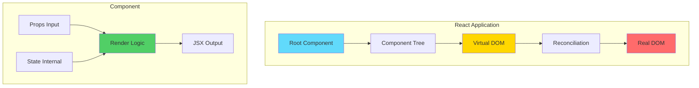
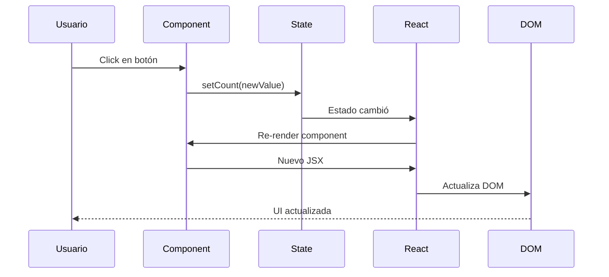
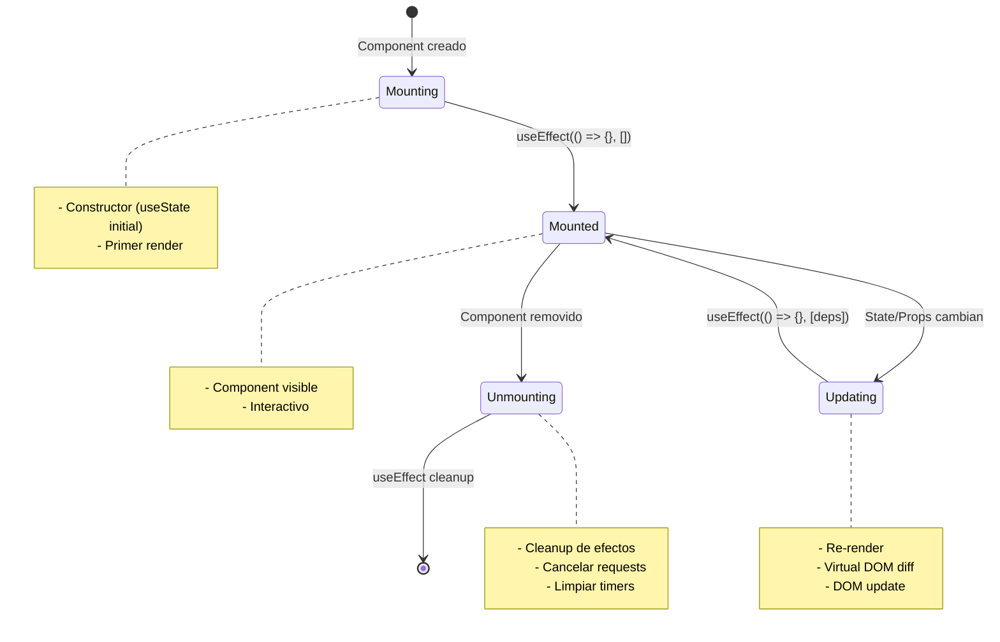
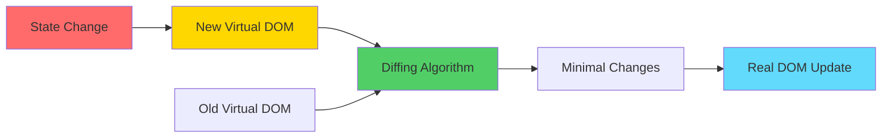
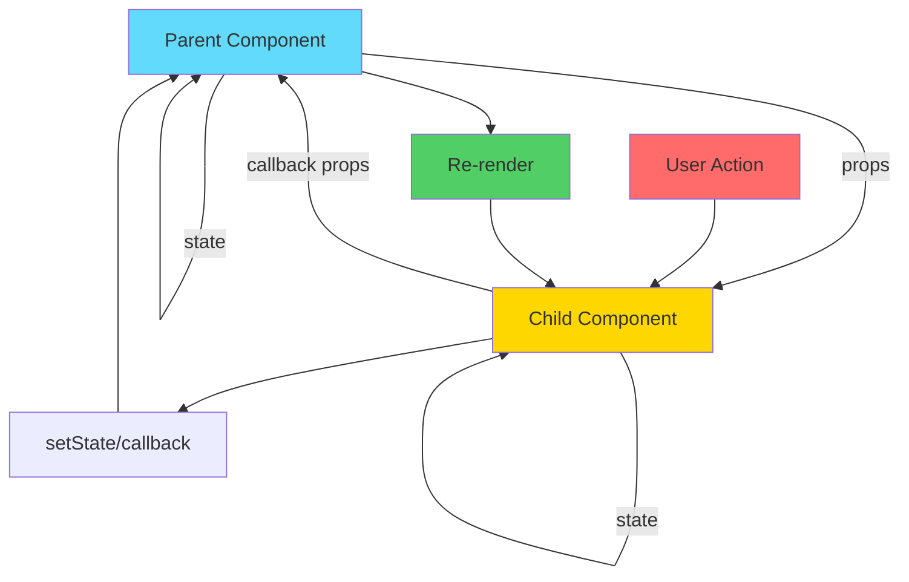
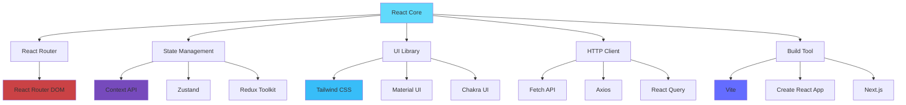
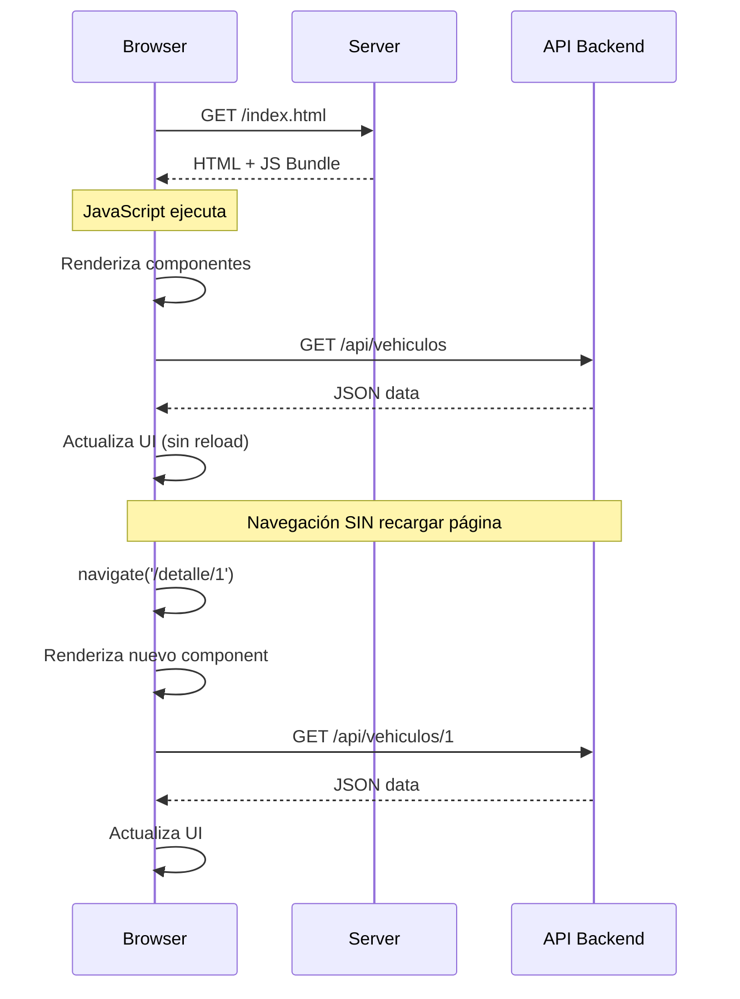
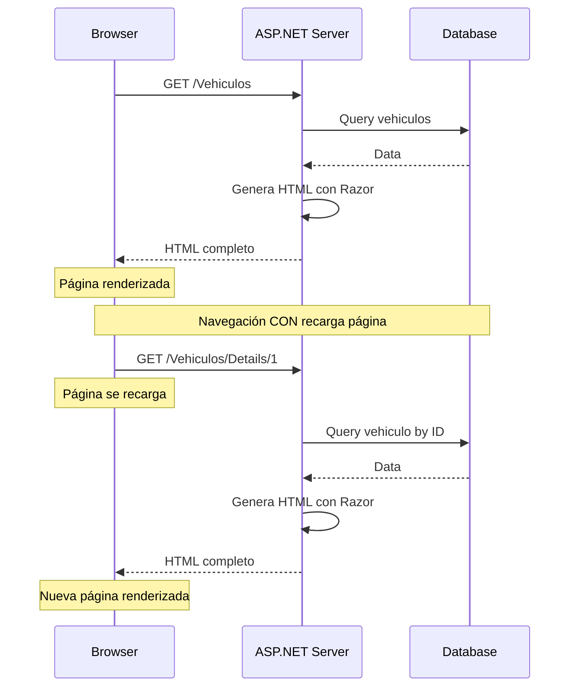
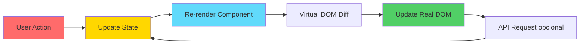
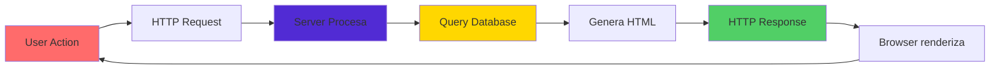

# ¿Cómo Funciona React?

## 📘 Guía Educativa Completa

Este documento explica los fundamentos de React, su arquitectura, conceptos clave, y cómo se compara con otras tecnologías de rendering como Razor Pages.

---

## 🎯 ¿Qué es React?

**React** es una biblioteca de JavaScript desarrollada por Facebook (Meta) para construir interfaces de usuario interactivas y dinámicas. Se enfoca en la creación de componentes reutilizables que gestionan su propio estado.

### Características Principales

- ✅ **Declarativo**: Describes cómo debe verse la UI, React se encarga del cómo
- ✅ **Basado en Componentes**: UI dividida en piezas reutilizables
- ✅ **Learn Once, Write Anywhere**: Mismo conocimiento para web, móvil (React Native), desktop
- ✅ **Virtual DOM**: Actualización eficiente del DOM real
- ✅ **Unidirectional Data Flow**: Flujo de datos predecible

### React en Números

- **Lanzamiento**: 2013
- **Creador**: Jordan Walke (Facebook)
- **Licencia**: MIT
- **Uso**: 40%+ de sitios web según BuiltWith
- **Comunidad**: Millones de desarrolladores

---

## 🏗️ Arquitectura de React



---

## 🧩 Conceptos Fundamentales

### 1. Componentes

Los componentes son las piezas básicas de construcción en React. Pueden ser **funcionales** (moderno) o **de clase** (legacy).

#### Componente Funcional

```typescript
// Component básico
function Welcome() {
  return <h1>Hola Mundo</h1>;
}

// Component con props
interface Props {
  name: string;
}

function Greeting({ name }: Props) {
  return <h1>Hola, {name}</h1>;
}

// Uso
<Greeting name="Juan" />
```

#### Component de Clase (Legacy)

```typescript
class Welcome extends React.Component {
  render() {
    return <h1>Hola Mundo</h1>;
  }
}
```

**Tendencia actual**: Componentes funcionales con Hooks (a partir de React 16.8)

### 2. JSX (JavaScript XML)

JSX es una sintaxis que parece HTML pero es JavaScript. Se transpila a llamadas `React.createElement()`.

```jsx
// JSX
const element = <h1 className="title">Hola</h1>;

// Se transpila a:
const element = React.createElement(
  'h1',
  { className: 'title' },
  'Hola'
);
```

**Reglas de JSX**:
- Un solo elemento raíz (o Fragment `<>...</>`)
- Los atributos HTML usan camelCase (`className`, `onClick`)
- Expresiones JavaScript entre llaves `{}`
- Componentes con mayúscula inicial

```jsx
// ✅ Correcto
const element = (
  <div>
    <h1 className="title">Título</h1>
    <p onClick={handleClick}>Texto con {variable}</p>
  </div>
);

// ✅ Con Fragment
const element = (
  <>
    <h1>Título</h1>
    <p>Párrafo</p>
  </>
);

// ❌ Incorrecto (múltiples raíces)
const element = (
  <h1>Título</h1>
  <p>Párrafo</p>
);
```

### 3. Props (Propiedades)

Props son **datos de entrada inmutables** que pasan del componente padre al hijo.

```typescript
interface VehiculoCardProps {
  marca: string;
  modelo: string;
  precio: number;
  onDelete: (id: string) => void;
}

function VehiculoCard({ marca, modelo, precio, onDelete }: VehiculoCardProps) {
  return (
    <div className="card">
      <h3>{marca} {modelo}</h3>
      <p>${precio}</p>
      <button onClick={() => onDelete('123')}>Eliminar</button>
    </div>
  );
}

// Uso
<VehiculoCard 
  marca="Toyota" 
  modelo="Corolla" 
  precio={25000}
  onDelete={handleDelete}
/>
```

**Características de Props**:
- ✅ Inmutables (read-only)
- ✅ Flujo unidireccional (padre → hijo)
- ✅ Pueden ser cualquier tipo (strings, numbers, functions, objects)
- ✅ Desestructuración recomendada

### 4. State (Estado)

State es **datos internos mutables** que el componente maneja. Cuando cambia, React re-renderiza.

```typescript
import { useState } from 'react';

function Counter() {
  // Declaración de estado
  const [count, setCount] = useState(0);
  
  // Función que actualiza el estado
  const increment = () => {
    setCount(count + 1);
  };
  
  // Actualización basada en valor anterior
  const incrementSafe = () => {
    setCount(prevCount => prevCount + 1);
  };
  
  return (
    <div>
      <p>Contador: {count}</p>
      <button onClick={increment}>+1</button>
      <button onClick={incrementSafe}>+1 Safe</button>
    </div>
  );
}
```

**Flujo de State**:



**Reglas del State**:
- ✅ No mutar directamente: `setCount(count + 1)` NO `count = count + 1`
- ✅ Las actualizaciones son asíncronas
- ✅ Usar función updater para actualizaciones basadas en valor anterior
- ✅ Cada componente tiene su propio estado

---

## 🪝 React Hooks

Los Hooks son funciones que permiten usar estado y otras características de React en componentes funcionales.

### Hook Básicos

#### 1. useState

Gestiona estado local en el componente.

```typescript
const [state, setState] = useState(initialValue);
```

**Ejemplo con objeto**:
```typescript
interface FormData {
  name: string;
  email: string;
}

function Form() {
  const [formData, setFormData] = useState<FormData>({
    name: '',
    email: ''
  });
  
  const handleChange = (field: keyof FormData, value: string) => {
    setFormData(prev => ({
      ...prev,
      [field]: value
    }));
  };
  
  return (
    <form>
      <input 
        value={formData.name}
        onChange={(e) => handleChange('name', e.target.value)}
      />
      <input 
        value={formData.email}
        onChange={(e) => handleChange('email', e.target.value)}
      />
    </form>
  );
}
```

#### 2. useEffect

Ejecuta efectos secundarios (side effects) como fetch, suscripciones, timers.

```typescript
useEffect(() => {
  // Efecto
  return () => {
    // Cleanup (opcional)
  };
}, [dependencies]);
```

**Casos de uso**:

```typescript
// 1. Ejecutar una vez (componentDidMount)
useEffect(() => {
  console.log('Componente montado');
}, []); // Array vacío

// 2. Ejecutar cuando cambie una dependencia
useEffect(() => {
  fetchData(id);
}, [id]); // Se ejecuta cuando 'id' cambia

// 3. Ejecutar en cada render (no recomendado)
useEffect(() => {
  console.log('Cada render');
}); // Sin array de dependencias

// 4. Con cleanup
useEffect(() => {
  const interval = setInterval(() => {
    console.log('Tick');
  }, 1000);
  
  return () => {
    clearInterval(interval); // Cleanup
  };
}, []);
```

**Ejemplo completo de fetch**:
```typescript
function VehiculosList() {
  const [vehiculos, setVehiculos] = useState<Vehiculo[]>([]);
  const [loading, setLoading] = useState(true);
  const [error, setError] = useState<string | null>(null);
  
  useEffect(() => {
    const fetchVehiculos = async () => {
      try {
        setLoading(true);
        const response = await fetch('/api/Vehiculo');
        
        if (!response.ok) {
          throw new Error('Error al cargar');
        }
        
        const data = await response.json();
        setVehiculos(data);
      } catch (err) {
        setError(err.message);
      } finally {
        setLoading(false);
      }
    };
    
    fetchVehiculos();
  }, []); // Solo al montar
  
  if (loading) return <p>Cargando...</p>;
  if (error) return <p>Error: {error}</p>;
  
  return (
    <ul>
      {vehiculos.map(v => (
        <li key={v.id}>{v.marca}</li>
      ))}
    </ul>
  );
}
```

#### 3. useContext

Consume contexto sin prop drilling.

```typescript
// Crear contexto
const ThemeContext = createContext<'light' | 'dark'>('light');

// Provider
function App() {
  const [theme, setTheme] = useState<'light' | 'dark'>('light');
  
  return (
    <ThemeContext.Provider value={theme}>
      <ChildComponent />
    </ThemeContext.Provider>
  );
}

// Consumer
function ChildComponent() {
  const theme = useContext(ThemeContext);
  
  return <div className={theme}>Themed content</div>;
}
```

### Hooks de Optimización

#### 4. useMemo

Memoriza valores calculados para evitar recálculos costosos.

```typescript
const expensiveValue = useMemo(() => {
  return expensiveCalculation(a, b);
}, [a, b]); // Solo recalcula si a o b cambian
```

**Ejemplo**:
```typescript
function ProductList({ items }) {
  // Filtrado costoso memoizado
  const expensiveItems = useMemo(() => {
    return items
      .filter(item => item.price > 1000)
      .sort((a, b) => b.price - a.price);
  }, [items]);
  
  return (
    <ul>
      {expensiveItems.map(item => (
        <li key={item.id}>{item.name}</li>
      ))}
    </ul>
  );
}
```

#### 5. useCallback

Memoriza funciones para evitar recrearlas en cada render.

```typescript
const memoizedCallback = useCallback(() => {
  doSomething(a, b);
}, [a, b]); // Solo crea nueva función si a o b cambian
```

**Cuándo usar**:
- Pasando callbacks a componentes hijos memoizados
- Dependencias de useEffect
- Event handlers en listas

```typescript
function Parent() {
  const [count, setCount] = useState(0);
  
  // Sin useCallback: nueva función en cada render
  const handleClick = () => {
    console.log('Clicked');
  };
  
  // Con useCallback: misma función si dependencies no cambian
  const handleClickMemo = useCallback(() => {
    console.log('Clicked', count);
  }, [count]);
  
  return <ChildComponent onClick={handleClickMemo} />;
}

const ChildComponent = React.memo(({ onClick }) => {
  console.log('Child rendered');
  return <button onClick={onClick}>Click</button>;
});
```

#### 6. useRef

Crea referencias mutables que persisten entre renders, o accede a elementos DOM.

```typescript
const ref = useRef(initialValue);

// Casos de uso:
// 1. Acceder a DOM
// 2. Guardar valores mutables sin causar re-render
// 3. Guardar valor anterior
```

**Ejemplos**:

```typescript
// 1. Focus en input
function InputFocus() {
  const inputRef = useRef<HTMLInputElement>(null);
  
  const handleFocus = () => {
    inputRef.current?.focus();
  };
  
  return (
    <>
      <input ref={inputRef} />
      <button onClick={handleFocus}>Focus Input</button>
    </>
  );
}

// 2. Contador sin re-render
function Timer() {
  const countRef = useRef(0);
  
  useEffect(() => {
    const interval = setInterval(() => {
      countRef.current += 1;
      console.log('Count:', countRef.current);
    }, 1000);
    
    return () => clearInterval(interval);
  }, []);
  
  return <div>Check console</div>;
}

// 3. Valor anterior
function usePrevious<T>(value: T) {
  const ref = useRef<T>();
  
  useEffect(() => {
    ref.current = value;
  });
  
  return ref.current;
}
```

### Custom Hooks

Puedes crear tus propios hooks para reutilizar lógica.

```typescript
// Custom Hook: useVehiculos
function useVehiculos() {
  const [vehiculos, setVehiculos] = useState<Vehiculo[]>([]);
  const [loading, setLoading] = useState(true);
  const [error, setError] = useState<string | null>(null);
  
  useEffect(() => {
    const fetchData = async () => {
      try {
        setLoading(true);
        const response = await fetch('/api/Vehiculo');
        const data = await response.json();
        setVehiculos(data);
      } catch (err) {
        setError(err.message);
      } finally {
        setLoading(false);
      }
    };
    
    fetchData();
  }, []);
  
  return { vehiculos, loading, error };
}

// Uso
function VehiculosPage() {
  const { vehiculos, loading, error } = useVehiculos();
  
  if (loading) return <div>Cargando...</div>;
  if (error) return <div>Error: {error}</div>;
  
  return (
    <ul>
      {vehiculos.map(v => (
        <li key={v.id}>{v.marca}</li>
      ))}
    </ul>
  );
}
```

**Reglas de los Hooks**:
1. ✅ Solo llamar en el nivel superior (no en loops, condicionales, funciones anidadas)
2. ✅ Solo llamar desde componentes funcionales o custom hooks
3. ✅ Nombres con prefijo `use`

---

## 🔄 Ciclo de Vida de Componentes

### Con Hooks (Moderno)



**Equivalencias con clases**:

```typescript
// MOUNT: componentDidMount
useEffect(() => {
  console.log('Component mounted');
}, []);

// UPDATE: componentDidUpdate (cuando cambia 'count')
useEffect(() => {
  console.log('Count changed:', count);
}, [count]);

// UNMOUNT: componentWillUnmount
useEffect(() => {
  return () => {
    console.log('Component will unmount');
  };
}, []);

// Combinado: Mount + Update + Unmount
useEffect(() => {
  console.log('Mounted or count changed');
  
  return () => {
    console.log('Cleanup before next effect or unmount');
  };
}, [count]);
```

---

## 🎨 Virtual DOM

El Virtual DOM es una representación en memoria del DOM real. React lo usa para optimizar actualizaciones.

### ¿Cómo Funciona?



### Proceso de Reconciliación

1. **State/Props cambian**
2. React crea un **nuevo Virtual DOM**
3. **Compara** (diff) con el Virtual DOM anterior
4. **Calcula** el mínimo de cambios necesarios
5. **Actualiza** solo esas partes en el DOM real

```typescript
// Ejemplo: Solo actualiza el precio, no todo el componente
function Product({ name, price }) {
  return (
    <div>
      <h3>{name}</h3>      {/* No cambia */}
      <p>${price}</p>      {/* ✅ Solo esto cambia */}
    </div>
  );
}

// Cuando price cambia de 100 a 150:
// React solo actualiza el <p>, no el <div> ni el <h3>
```

### Keys en Listas

Las **keys** ayudan a React a identificar qué elementos cambiaron.

```typescript
// ❌ Incorrecto: sin key o con index
{items.map((item, index) => (
  <li key={index}>{item.name}</li>
))}

// ✅ Correcto: con ID único
{items.map((item) => (
  <li key={item.id}>{item.name}</li>
))}
```

**Por qué usar IDs únicos**:
- React puede identificar qué elemento se agregó/eliminó/movió
- Preserva estado de componentes
- Evita bugs en formularios y animaciones

---

## 📊 Flujo de Datos en React

React sigue un flujo **unidireccional** (one-way data flow).



### Comunicación Padre-Hijo

```typescript
// Parent Component
function Parent() {
  const [message, setMessage] = useState('Hello');
  
  const handleChildMessage = (childMsg: string) => {
    console.log('Message from child:', childMsg);
    setMessage(childMsg);
  };
  
  return (
    <div>
      <p>Parent message: {message}</p>
      <Child 
        parentMessage={message}           {/* Props down */}
        onSendMessage={handleChildMessage} {/* Callbacks up */}
      />
    </div>
  );
}

// Child Component
interface ChildProps {
  parentMessage: string;
  onSendMessage: (msg: string) => void;
}

function Child({ parentMessage, onSendMessage }: ChildProps) {
  const handleClick = () => {
    onSendMessage('Hi from child!');
  };
  
  return (
    <div>
      <p>Received: {parentMessage}</p>
      <button onClick={handleClick}>Send to Parent</button>
    </div>
  );
}
```

**Flujo**:
1. Parent pasa `props` al Child (datos hacia abajo)
2. Child ejecuta `callback` cuando ocurre un evento (comunicación hacia arriba)
3. Parent actualiza su `state`
4. Parent se re-renderiza
5. Child recibe nuevos `props` y se re-renderiza

---

## ⚡ Optimización de Rendimiento

### 1. React.memo

Memoriza componentes para evitar re-renders innecesarios.

```typescript
// Sin memo: se renderiza en cada render del parent
function ExpensiveComponent({ data }) {
  console.log('Rendering expensive component');
  return <div>{data}</div>;
}

// Con memo: solo se renderiza si 'data' cambia
const MemoizedComponent = React.memo(function ExpensiveComponent({ data }) {
  console.log('Rendering expensive component');
  return <div>{data}</div>;
});

// Uso
function Parent() {
  const [count, setCount] = useState(0);
  const data = "Static data";
  
  return (
    <>
      <button onClick={() => setCount(count + 1)}>Count: {count}</button>
      <MemoizedComponent data={data} /> {/* No re-renderiza */}
    </>
  );
}
```

### 2. Code Splitting

Divide tu aplicación en chunks más pequeños que se cargan bajo demanda.

```typescript
// Lazy loading de componentes
import { lazy, Suspense } from 'react';

const LazyComponent = lazy(() => import('./LazyComponent'));

function App() {
  return (
    <Suspense fallback={<div>Loading...</div>}>
      <LazyComponent />
    </Suspense>
  );
}
```

### 3. Evitar Renders Innecesarios

```typescript
// ❌ Malo: crea nueva función en cada render
function Parent() {
  return <Child onClick={() => console.log('click')} />;
}

// ✅ Bueno: función memoizada
function Parent() {
  const handleClick = useCallback(() => {
    console.log('click');
  }, []);
  
  return <Child onClick={handleClick} />;
}
```

---

## 🧪 Patrones Comunes

### 1. Presentational vs Container Components

```typescript
// Container Component (lógica)
function VehiculosContainer() {
  const { vehiculos, loading, error } = useVehiculos();
  
  return (
    <VehiculosPresentation 
      vehiculos={vehiculos}
      loading={loading}
      error={error}
    />
  );
}

// Presentational Component (UI pura)
interface Props {
  vehiculos: Vehiculo[];
  loading: boolean;
  error: string | null;
}

function VehiculosPresentation({ vehiculos, loading, error }: Props) {
  if (loading) return <div>Loading...</div>;
  if (error) return <div>Error: {error}</div>;
  
  return (
    <ul>
      {vehiculos.map(v => (
        <li key={v.id}>{v.marca}</li>
      ))}
    </ul>
  );
}
```

### 2. Compound Components

```typescript
// Component padre y sus subcomponents trabajan juntos
function Tabs({ children }) {
  const [activeTab, setActiveTab] = useState(0);
  
  return (
    <div className="tabs">
      {React.Children.map(children, (child, index) => {
        return React.cloneElement(child, {
          isActive: index === activeTab,
          onClick: () => setActiveTab(index)
        });
      })}
    </div>
  );
}

function Tab({ label, isActive, onClick, children }) {
  return (
    <div>
      <button 
        className={isActive ? 'active' : ''} 
        onClick={onClick}
      >
        {label}
      </button>
      {isActive && <div>{children}</div>}
    </div>
  );
}

// Uso
<Tabs>
  <Tab label="Tab 1">Content 1</Tab>
  <Tab label="Tab 2">Content 2</Tab>
</Tabs>
```

### 3. Render Props

```typescript
interface MouseTrackerProps {
  render: (position: { x: number; y: number }) => JSX.Element;
}

function MouseTracker({ render }: MouseTrackerProps) {
  const [position, setPosition] = useState({ x: 0, y: 0 });
  
  useEffect(() => {
    const handleMouseMove = (e: MouseEvent) => {
      setPosition({ x: e.clientX, y: e.clientY });
    };
    
    window.addEventListener('mousemove', handleMouseMove);
    return () => window.removeEventListener('mousemove', handleMouseMove);
  }, []);
  
  return render(position);
}

// Uso
<MouseTracker 
  render={({ x, y }) => (
    <div>Mouse position: {x}, {y}</div>
  )}
/>
```

---

## 🌐 React en el Ecosistema Moderno

### Stack Típico



---

## 🆚 React vs Razor Pages

### ¿Qué son Razor Pages?

**Razor Pages** es un framework de ASP.NET Core para crear aplicaciones web con un modelo de página. Combina C# y HTML usando la sintaxis Razor.

### Comparación Fundamental

| Aspecto | **React** | **Razor Pages** |
|---------|-----------|----------------|
| **Tipo** | Biblioteca JavaScript (Client-Side) | Framework Server-Side (ASP.NET Core) |
| **Rendering** | Client-Side Rendering (CSR) | Server-Side Rendering (SSR) |
| **Lenguaje** | JavaScript/TypeScript + JSX | C# + Razor Syntax |
| **Ejecución** | En el navegador | En el servidor |
| **Estado** | Gestionado en cliente (useState, Context) | Gestionado en servidor (PageModel) |
| **Navegación** | SPA (sin recargar página) | MPAs (recarga página completa) |
| **SEO** | Requiere SSR (Next.js) o pre-rendering | Excelente (HTML generado en servidor) |
| **Performance inicial** | Más lenta (descarga JS) | Más rápida (HTML listo) |
| **Interactividad** | Altamente interactiva | Limitada sin JavaScript adicional |

### Arquitectura

#### React (SPA - Single Page Application)



#### Razor Pages (MPA - Multi Page Application)



### Sintaxis y Código

#### React - JSX + TypeScript

```typescript
// VehiculosPage.tsx
import { useState, useEffect } from 'react';

interface Vehiculo {
  id: string;
  marca: string;
  modelo: string;
  precio: number;
}

function VehiculosPage() {
  const [vehiculos, setVehiculos] = useState<Vehiculo[]>([]);
  const [loading, setLoading] = useState(true);
  
  useEffect(() => {
    fetch('/api/vehiculos')
      .then(res => res.json())
      .then(data => {
        setVehiculos(data);
        setLoading(false);
      });
  }, []);
  
  if (loading) return <div>Cargando...</div>;
  
  return (
    <div className="container">
      <h1>Lista de Vehículos</h1>
      <ul>
        {vehiculos.map(v => (
          <li key={v.id}>
            {v.marca} {v.modelo} - ${v.precio}
          </li>
        ))}
      </ul>
    </div>
  );
}

export default VehiculosPage;
```

#### Razor Pages - C# + Razor

```csharp
// Vehiculos.cshtml.cs (PageModel)
public class VehiculosModel : PageModel
{
    private readonly IVehiculoService _service;
    
    public VehiculosModel(IVehiculoService service)
    {
        _service = service;
    }
    
    public List<Vehiculo> Vehiculos { get; set; }
    public bool Loading { get; set; } = true;
    
    public async Task OnGetAsync()
    {
        Vehiculos = await _service.GetAllAsync();
        Loading = false;
    }
}
```

```html
<!-- Vehiculos.cshtml (View) -->
@page
@model VehiculosModel

<div class="container">
    <h1>Lista de Vehículos</h1>
    
    @if (Model.Loading)
    {
        <div>Cargando...</div>
    }
    else
    {
        <ul>
            @foreach (var vehiculo in Model.Vehiculos)
            {
                <li>
                    @vehiculo.Marca @vehiculo.Modelo - $@vehiculo.Precio
                </li>
            }
        </ul>
    }
</div>
```

### Flujo de Datos

#### React - Unidireccional (Cliente)



#### Razor Pages - Request-Response (Servidor)



### Gestión de Estado

#### React

```typescript
// Estado local
const [count, setCount] = useState(0);

// Estado compartido (Context)
const UserContext = createContext();

function App() {
  const [user, setUser] = useState(null);
  
  return (
    <UserContext.Provider value={{ user, setUser }}>
      <ChildComponents />
    </UserContext.Provider>
  );
}

// Custom Hook para estado
function useAuth() {
  const [user, setUser] = useState(null);
  
  const login = async (credentials) => {
    const user = await authService.login(credentials);
    setUser(user);
  };
  
  return { user, login };
}
```

#### Razor Pages

```csharp
// Estado en PageModel
public class IndexModel : PageModel
{
    // Property binding
    [BindProperty]
    public string SearchTerm { get; set; }
    
    // Estado de página
    public List<Vehiculo> Results { get; set; }
    
    // Estado compartido (Session)
    public void OnGet()
    {
        var userId = HttpContext.Session.GetString("UserId");
        Results = _service.Search(SearchTerm);
    }
    
    // TempData para compartir entre requests
    public IActionResult OnPost()
    {
        TempData["Message"] = "Guardado exitosamente";
        return RedirectToPage("Success");
    }
}
```

### Formularios

#### React - Controlados

```typescript
function VehiculoForm() {
  const [formData, setFormData] = useState({
    marca: '',
    modelo: '',
    precio: 0
  });
  
  const handleChange = (e: React.ChangeEvent<HTMLInputElement>) => {
    setFormData({
      ...formData,
      [e.target.name]: e.target.value
    });
  };
  
  const handleSubmit = async (e: React.FormEvent) => {
    e.preventDefault();
    await fetch('/api/vehiculos', {
      method: 'POST',
      headers: { 'Content-Type': 'application/json' },
      body: JSON.stringify(formData)
    });
  };
  
  return (
    <form onSubmit={handleSubmit}>
      <input name="marca" value={formData.marca} onChange={handleChange} />
      <input name="modelo" value={formData.modelo} onChange={handleChange} />
      <input name="precio" type="number" value={formData.precio} onChange={handleChange} />
      <button type="submit">Guardar</button>
    </form>
  );
}
```

#### Razor Pages - Tag Helpers

```html
<!-- Crear.cshtml -->
@page
@model CrearModel

<form method="post">
    <div class="form-group">
        <label asp-for="Vehiculo.Marca"></label>
        <input asp-for="Vehiculo.Marca" class="form-control" />
        <span asp-validation-for="Vehiculo.Marca"></span>
    </div>
    
    <div class="form-group">
        <label asp-for="Vehiculo.Modelo"></label>
        <input asp-for="Vehiculo.Modelo" class="form-control" />
        <span asp-validation-for="Vehiculo.Modelo"></span>
    </div>
    
    <div class="form-group">
        <label asp-for="Vehiculo.Precio"></label>
        <input asp-for="Vehiculo.Precio" type="number" class="form-control" />
        <span asp-validation-for="Vehiculo.Precio"></span>
    </div>
    
    <button type="submit">Guardar</button>
</form>
```

```csharp
// Crear.cshtml.cs
public class CrearModel : PageModel
{
    private readonly IVehiculoService _service;
    
    [BindProperty]
    public Vehiculo Vehiculo { get; set; }
    
    public async Task<IActionResult> OnPostAsync()
    {
        if (!ModelState.IsValid)
        {
            return Page();
        }
        
        await _service.CreateAsync(Vehiculo);
        return RedirectToPage("Index");
    }
}
```

### Validación

#### React

```typescript
// Validación en cliente
function VehiculoForm() {
  const [errors, setErrors] = useState({});
  
  const validate = (data) => {
    const errors = {};
    
    if (!data.marca) {
      errors.marca = 'Marca es requerida';
    }
    
    if (data.precio <= 0) {
      errors.precio = 'Precio debe ser mayor a 0';
    }
    
    return errors;
  };
  
  const handleSubmit = (e) => {
    e.preventDefault();
    const validationErrors = validate(formData);
    
    if (Object.keys(validationErrors).length > 0) {
      setErrors(validationErrors);
      return;
    }
    
    // Submit
  };
  
  return (
    <form onSubmit={handleSubmit}>
      <input name="marca" />
      {errors.marca && <span className="error">{errors.marca}</span>}
      {/* ... */}
    </form>
  );
}
```

#### Razor Pages

```csharp
// Validación con Data Annotations
public class Vehiculo
{
    [Required(ErrorMessage = "Marca es requerida")]
    [StringLength(50)]
    public string Marca { get; set; }
    
    [Required(ErrorMessage = "Modelo es requerido")]
    public string Modelo { get; set; }
    
    [Range(1, double.MaxValue, ErrorMessage = "Precio debe ser mayor a 0")]
    public decimal Precio { get; set; }
}

// En PageModel
public async Task<IActionResult> OnPostAsync()
{
    if (!ModelState.IsValid)
    {
        return Page(); // Vuelve a mostrar con errores
    }
    
    await _service.CreateAsync(Vehiculo);
    return RedirectToPage("Index");
}
```

### Ventajas y Desventajas

#### React

**✅ Ventajas**:
- Altamente interactivo (SPA)
- Navegación instantánea (sin recargas)
- Reutilización de componentes
- Gran ecosistema y comunidad
- Multiplataforma (web, móvil con React Native)
- State management avanzado
- Hot reload en desarrollo

**❌ Desventajas**:
- Carga inicial más lenta (bundle JS grande)
- SEO más difícil (requiere SSR o pre-rendering)
- Más complejo para principiantes
- JavaScript debe estar habilitado
- Mayor consumo de recursos del cliente

#### Razor Pages

**✅ Ventajas**:
- Carga inicial muy rápida (HTML listo)
- SEO excelente (HTML en servidor)
- Menos JavaScript requerido
- Tipado fuerte con C#
- Integración perfecta con .NET ecosystem
- Seguridad manejada en servidor
- Menor consumo de recursos del cliente

**❌ Desventajas**:
- Menos interactividad
- Navegación con recarga de página
- No es SPA por defecto
- Menos moderno que React
- Limitado a ecosistema .NET
- Requiere servidor siempre disponible

### ¿Cuándo Usar Cada Uno?

#### Usa React cuando:
- ✅ Necesitas una SPA altamente interactiva
- ✅ La aplicación es como una "app de escritorio en web"
- ✅ Tienes un backend API separado
- ✅ Quieres reutilizar código en móvil (React Native)
- ✅ El equipo domina JavaScript/TypeScript
- ✅ SEO no es crítico (o usas Next.js)

**Ejemplos**: Facebook, Instagram, Airbnb, Netflix

#### Usa Razor Pages cuando:
- ✅ Necesitas SEO excelente
- ✅ La aplicación es mayormente contenido estático
- ✅ El equipo domina C# y .NET
- ✅ Quieres desarrollo rápido con menos JavaScript
- ✅ La aplicación es tradicional (formularios, reportes)
- ✅ Hosting en infraestructura Windows/.NET

**Ejemplos**: Blogs, e-commerce, portales corporativos, aplicaciones empresariales

### Híbrido: Lo Mejor de Ambos Mundos

Muchas aplicaciones modernas combinan ambos:

```
Frontend: React (SPA)
    ↓
Backend: ASP.NET Core (Web API)
    ↓
Razor Pages: Panel de administración
```

O usar frameworks que combinan:
- **Next.js**: React con SSR
- **Blazor**: Razor components con C# (similar a React pero .NET)

---

## 🎓 Conclusión

React es una biblioteca poderosa para crear interfaces de usuario dinámicas y reutilizables. Sus conceptos fundamentales son:

1. **Componentes**: Bloques de construcción reutilizables
2. **JSX**: Sintaxis HTML-like en JavaScript
3. **Props**: Datos de entrada inmutables
4. **State**: Datos internos mutables
5. **Hooks**: Funciones para usar características de React
6. **Virtual DOM**: Optimización de actualizaciones
7. **Unidirectional Flow**: Flujo de datos predecible

Comparado con Razor Pages, React ofrece más interactividad y experiencia de SPA, mientras que Razor Pages ofrece mejor performance inicial y SEO. La elección depende de los requisitos del proyecto, el equipo, y el tipo de aplicación.

**Recomendación**: Para aplicaciones modernas y altamente interactivas, React es excelente. Para aplicaciones tradicionales con mucho contenido y SEO crítico, Razor Pages es más apropiado.

---

**Referencias**:
- [React Documentation](https://react.dev/)
- [React Hooks Reference](https://react.dev/reference/react)
- [ASP.NET Core Razor Pages](https://learn.microsoft.com/en-us/aspnet/core/razor-pages/)
