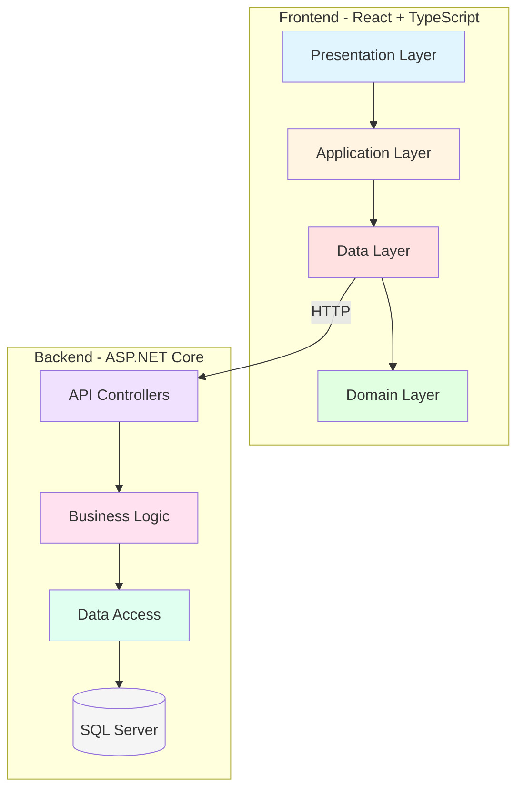
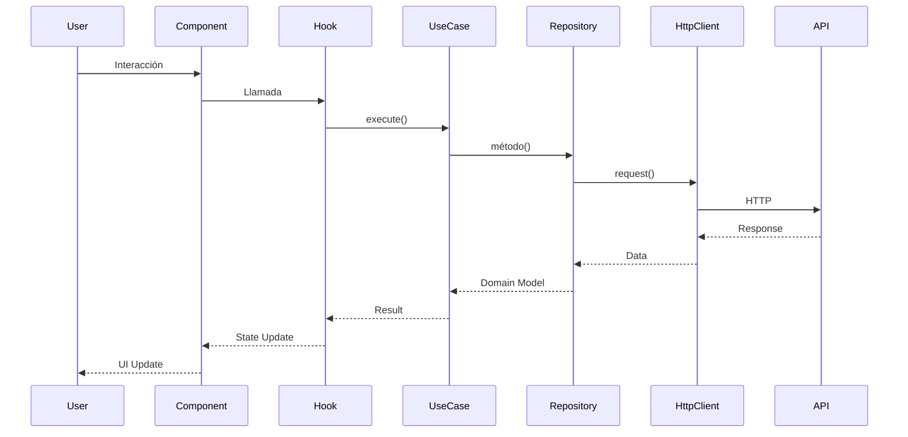

# Documentación del Sistema de Gestión de Vehículos

## 📚 Guía de Estudio para Estudiantes

Esta documentación educativa explica la implementación completa de un sistema CRUD (Create, Read, Update, Delete) para gestión de vehículos, desarrollado con **React + TypeScript** siguiendo los principios de **Clean Architecture** y **SOLID**.

---

## 🎯 Objetivo Educativo

Aprender a:
- Diseñar arquitecturas limpias y escalables
- Aplicar principios SOLID en código real
- Separar responsabilidades en capas
- Implementar operaciones CRUD completas
- Crear interfaces de usuario modernas con Tailwind CSS
- Manejar estados y efectos en React
- Trabajar con APIs RESTful

---

## 📖 Índice de Documentos

### 0️⃣ [Configuración Inicial](./00-configuracion-inicial.md)

**Temas cubiertos:**
- Setup del proyecto (React + Vite + TypeScript)
- Estructura de carpetas por capas
- Configuración de Tailwind CSS
- Principios SOLID explicados
- Clean Architecture fundamentals
- Diagramas de arquitectura

**Conceptos clave:**
- Domain, Data, Application, Presentation layers
- Dependency Inversion
- Interface Segregation
- Single Responsibility

📊 **Incluye:** 2 diagramas Mermaid (arquitectura + capas)

---

### 1️⃣ [Listar Vehículos - GET all](./01-get-listar-vehiculos.md)

**Operación:** `GET /api/Vehiculo`

**Temas cubiertos:**
- Fetching de datos desde API
- Custom Hooks en React
- Paginación en cliente
- Estados de carga, error y éxito
- Componentes presentacionales
- Optimización con useMemo/useCallback

**Arquitectura:**
```
VehiculosPage → useVehiculos → GetVehiculos (UseCase) → Repository → API
```

📊 **Incluye:** 4 diagramas (secuencia, arquitectura, flujo de estados, paginación)

---

### 2️⃣ [Crear Vehículo - POST](./02-post-crear-vehiculo.md)

**Operación:** `POST /api/Vehiculo`

**Temas cubiertos:**
- Formularios controlados en React
- Validación de campos (HTML5 + Custom)
- Manejo de respuestas 201 Created sin body
- Cascada de selects (Marca → Modelo)
- Modal de éxito con bloqueo de pantalla
- Reutilización de componentes

**Desafíos resueltos:**
- API retorna 201 con `Content-Length: 0`
- Extraer ID del header `Location`
- Prevenir double submit

📊 **Incluye:** 5 diagramas (secuencia completo, arquitectura, estados, validaciones, respuestas especiales)

---

### 3️⃣ [Ver Detalle de Vehículo - GET by ID](./03-get-detalle-vehiculo.md)

**Operación:** `GET /api/Vehiculo/{id}`

**Temas cubiertos:**
- Parámetros de ruta con React Router
- Interfaces segregadas (VehiculoDetalle vs VehiculoResponse)
- Badges visuales dinámicos
- Información organizada en grids
- Manejo de vehículos no encontrados
- Navegación entre vistas

**Diferenciadores:**
- Datos adicionales (registroValido, revisionValida)
- Vista enriquecida con iconografía
- Hero section destacada

📊 **Incluye:** 4 diagramas (secuencia, arquitectura, estados, diferencias GET all vs by ID)

---

### 4️⃣ [Editar Vehículo - PUT](./04-put-editar-vehiculo.md)

**Operación:** `PUT /api/Vehiculo/{id}`

**Temas cubiertos:**
- Pre-población de formularios
- Conversión nombre → ID (Marca/Modelo)
- Reutilización de componentes (OCP)
- Manejo de 204 No Content
- Carga en cascada de datos
- Modal de éxito con redirección

**Desafío principal:**
```
Vehículo tiene: {marca: "Toyota", modelo: "Corolla"}
Formulario necesita: {idMarca: "uuid-123", idModelo: "uuid-456"}
```

**Solución:** Pipeline de búsqueda
1. Cargar todas las marcas
2. Buscar marca por nombre → obtener ID
3. Cargar modelos de esa marca
4. Buscar modelo por nombre → obtener ID

📊 **Incluye:** 6 diagramas (secuencia completo, arquitectura, conversión nombre-ID, flujo pre-población, estados, comparación POST vs PUT)

---

### 5️⃣ [Eliminar Vehículo - DELETE](./05-delete-eliminar-vehiculo.md)

**Operación:** `DELETE /api/Vehiculo/{id}`

**Temas cubiertos:**
- Popup de confirmación personalizado (no window.confirm)
- Acciones destructivas con confirmación
- Estados del modal (abrir/cerrar/confirmando)
- Prevención de eliminación accidental
- Feedback visual (spinner, disabled)
- Hook reutilizable en múltiples páginas

**Diseño del modal:**
- Overlay con backdrop blur
- Icono de advertencia grande
- Mensaje claro de consecuencias
- Botones deshabilitados durante operación
- Gradiente rojo para acción destructiva

📊 **Incluye:** 5 diagramas (secuencia con modal, arquitectura, diseño del modal, flujo de estados, UX capas de confirmación)

---

## 🏗️ Arquitectura General del Sistema



---

## 🎨 Tecnologías Utilizadas

### Frontend
- **React 19** - UI library
- **TypeScript** - Type safety
- **Vite** - Build tool
- **React Router DOM v6** - Routing
- **Tailwind CSS v3.4.1** - Styling
- **Fetch API** - HTTP requests (sin axios u otras librerías)

### Backend (ya implementado)
- **ASP.NET Core** - Web API
- **SQL Server** - Base de datos
- **Dapper** - ORM ligero

---

## 📐 Principios SOLID en Acción

### Single Responsibility Principle (SRP)
```
✅ Cada clase/módulo tiene UNA sola razón para cambiar
- VehiculoForm: Solo renderiza campos
- useVehiculos: Solo gestiona estado de vehículos
- GetVehiculos: Solo contiene lógica de obtener vehículos
```

### Open/Closed Principle (OCP)
```
✅ Abierto a extensión, cerrado a modificación
- VehiculoForm funciona para CREATE y UPDATE sin cambios
- HttpClient puede tener múltiples implementaciones (Fetch, Axios)
```

### Liskov Substitution Principle (LSP)
```
✅ Las implementaciones pueden sustituirse por sus abstracciones
- Cualquier HttpClient funciona donde se espere la interfaz
```

### Interface Segregation Principle (ISP)
```
✅ Interfaces específicas y pequeñas
- VehiculoResponse: Para listas
- VehiculoDetalle: Para vista individual
- VehiculoRequest: Para crear/actualizar
```

### Dependency Inversion Principle (DIP)
```
✅ Depender de abstracciones, no de concreciones
- Use Cases dependen de Repository Interface
- Repositories dependen de HttpClient Interface
```

---

## 🔄 Flujo de Datos Completo



---

## 📊 Operaciones CRUD Comparadas

| Operación | Método | Endpoint | Request Body | Response | Complejidad |
|-----------|---------|----------|--------------|----------|-------------|
| **Listar** | GET | `/api/Vehiculo` | - | `VehiculoResponse[]` | ⭐⭐ |
| **Crear** | POST | `/api/Vehiculo` | `VehiculoRequest` | 201 + Location | ⭐⭐⭐ |
| **Detalle** | GET | `/api/Vehiculo/{id}` | - | `VehiculoDetalle` | ⭐⭐ |
| **Editar** | PUT | `/api/Vehiculo/{id}` | `VehiculoRequest` | 204 No Content | ⭐⭐⭐⭐ |
| **Eliminar** | DELETE | `/api/Vehiculo/{id}` | - | 204 No Content | ⭐⭐ |

**Complejidad:**
- **Listar**: Simple fetch con estados
- **Crear**: Formulario + validación + cascada marca-modelo
- **Detalle**: Fetch by ID + UI enriquecida
- **Editar**: Pre-población + conversión nombre→ID + formulario
- **Eliminar**: Confirmación + actualización de lista

---

## 🎓 Conceptos Avanzados Aplicados

### 1. Custom Hooks Pattern
```typescript
// Encapsula lógica reutilizable
const { vehiculos, loading, error } = useVehiculos();
```

### 2. Repository Pattern
```typescript
// Abstrae el acceso a datos
interface VehiculoRepository {
  getAll(): Promise<VehiculoResponse[]>;
  getById(id: string): Promise<VehiculoDetalle>;
  // ...
}
```

### 3. Use Case Pattern
```typescript
// Encapsula lógica de negocio
class GetVehiculos {
  async execute(): Promise<VehiculoResponse[]> {
    // Validaciones, transformaciones, lógica
    return await this.repository.getAll();
  }
}
```

### 4. Separation of Concerns
```
Domain    → Qué es (Modelos, Interfaces)
Data      → Cómo se obtiene (HTTP, Caché)
Application → Qué hacer (Lógica de negocio)
Presentation → Cómo se muestra (UI, Eventos)
```

### 5. Optimización de Renders
```typescript
// useMemo para valores calculados
const totalPages = useMemo(() => 
  Math.ceil(items.length / itemsPerPage), 
  [items, itemsPerPage]
);

// useCallback para funciones
const deleteVehiculo = useCallback(async (id: string) => {
  // ...
}, [dependency]);
```

---

## 🚀 Cómo Usar Esta Documentación

### Para Estudiantes

1. **Empezar por el principio**: Lee [00-configuracion-inicial.md](./00-configuracion-inicial.md) para entender la base
2. **Seguir el orden CRUD**: Listar → Crear → Detalle → Editar → Eliminar
3. **Revisar diagramas**: Los diagramas Mermaid explican visualmente los flujos
4. **Ejecutar el código**: Prueba cada funcionalidad mientras lees
5. **Experimentar**: Modifica el código y observa los resultados

### Para Docentes

- Cada documento es una lección completa
- Incluye teoría (SOLID, Clean Architecture) y práctica (código real)
- Diagramas para presentaciones
- Comparaciones y tablas para resumir conceptos
- Ejercicios sugeridos al final de cada documento

---

## 🔍 Temas de Investigación Sugeridos

1. **Alternativas a Fetch API**: Implementar con Axios o React Query
2. **State Management**: Migrar a Context API o Zustand
3. **Testing**: Agregar tests unitarios y de integración
4. **Optimización**: Implementar paginación en servidor
5. **Caché**: Agregar estrategias de caché local
6. **PWA**: Convertir en Progressive Web App
7. **i18n**: Internacionalización multiidioma
8. **Accesibilidad**: ARIA labels, navegación por teclado

---

## 📚 Recursos Adicionales

### Clean Architecture
- [The Clean Architecture - Robert C. Martin](https://blog.cleancoder.com/uncle-bob/2012/08/13/the-clean-architecture.html)
- [Clean Code - Book](https://www.amazon.com/Clean-Code-Handbook-Software-Craftsmanship/dp/0132350882)

### SOLID Principles
- [SOLID Principles Explained](https://www.digitalocean.com/community/conceptual_articles/s-o-l-i-d-the-first-five-principles-of-object-oriented-design)
- [Uncle Bob's SOLID Principles](https://www.youtube.com/watch?v=zHiWqnTWsn4)

### React Patterns
- [React Hooks Documentation](https://react.dev/reference/react)
- [React TypeScript Cheatsheet](https://react-typescript-cheatsheet.netlify.app/)

### Tailwind CSS
- [Tailwind CSS Documentation](https://tailwindcss.com/docs)
- [Tailwind UI Components](https://tailwindui.com/)

---

## 🤝 Contribuciones y Feedback

Esta documentación es un recurso vivo. Si encuentras:
- ❌ Errores o imprecisiones
- 💡 Oportunidades de mejora
- 📝 Temas que requieren más explicación
- 🎨 Mejores formas de visualizar conceptos

¡Tu feedback es bienvenido para mejorar el material educativo!

---

## 📄 Licencia

Este material educativo está disponible para uso académico. Se permite:
- Uso en clases y cursos
- Distribución con atribución
- Modificación para propósitos educativos

---

## 🔗 Documentación Relacionada

Este proyecto React forma parte de un **ecosistema completo** con múltiples arquitecturas. Para entender el sistema completo:

### 📚 Documentación del Sistema Completo

#### [**Sistema Completo - Visión Integral**](../../../../../docs/sistema-completo.md)
Documento maestro que explica cómo **Vehiculo.API**, **Vehiculos.WEB** y **Vehiculo.React** trabajan juntos.

**Incluye**:
- Arquitectura completa del ecosistema (10+ diagramas Mermaid)
- Comparación entre API, Razor Pages y React
- Flujos de datos end-to-end
- Estrategias de deployment (Azure, Docker, IIS)
- Testing strategies
- Métricas de performance
- Casos de uso recomendados

---

### 🔧 Backend - Vehiculo.API

#### [**Arquitectura del API ASP.NET Core**](../../../../../Vehiculo.API/docs/vehiculo-api-arquitectura.md)

El backend REST API que este proyecto React consume.

**Temas cubiertos**:
- ✅ Arquitectura en 6 capas (Controller → Flujo → Reglas/Servicios → DA → DB)
- ✅ Principios SOLID en backend
- ✅ Dependency Injection completa
- ✅ Dapper + Stored Procedures
- ✅ CORS configuration
- ✅ RESTful endpoints design

**Incluye 5+ diagramas Mermaid**:
- Arquitectura general de capas
- Flujo de request completo con validaciones
- Dependency Injection pipeline
- Comparación con frontend (React)

**¿Por qué leerlo?**
- Entender cómo el API procesa tus requests desde React
- Ver SOLID principles aplicados en backend C#
- Comprender separación de Business Logic, Data Access y Rules

---

### 🌐 Frontend Alternativo - Vehiculos.WEB

#### [**Arquitectura Razor Pages**](../../../../../Vehiculos.WEB/docs/vehiculos-web-arquitectura.md)

Una implementación **alternativa** del mismo sistema usando **Razor Pages** (Server-Side Rendering).

**Temas cubiertos**:
- ✅ PageModel pattern (patrón MVC simplificado)
- ✅ CRUD completo con formularios HTML nativos
- ✅ HttpClient para consumir el mismo API
- ✅ Bootstrap 5 UI
- ✅ Tag Helpers y Model Binding
- ✅ Server-Side Rendering vs Client-Side Rendering

**Incluye 6+ diagramas Mermaid**:
- Arquitectura MPA (Multi-Page Application)
- Lifecycle de Razor Pages
- Comparación visual: **Razor Pages vs React**

**¿Por qué leerlo?**
- Comparar **MPA (Razor Pages)** vs **SPA (React)**
- Ver mismas funcionalidades con diferentes enfoques
- Entender trade-offs entre Server-Side y Client-Side rendering
- Comparar Bootstrap vs Tailwind CSS

---

## 📊 Comparación Rápida: React vs Razor Pages

| Aspecto | **React (este proyecto)** | **Razor Pages** |
|---------|---------------------------|-----------------|
| **Rendering** | Client-Side | Server-Side |
| **Navegación** | Sin reload (SPA) | Full page reload (MPA) |
| **Estado** | Persiste en memoria (useState) | No persiste entre requests |
| **SEO** | ⚠️ Requiere SSR | ✅ Excelente por defecto |
| **Interactividad** | ✅ Alta (sin reloads) | ⚠️ Limitada (reloads) |
| **Performance Inicial** | ⚠️ Descarga JS bundle | ✅ HTML ya renderizado |
| **Performance Uso** | ✅ Fluida (solo JSON) | ⚠️ HTML completo cada vez |
| **UI Framework** | Tailwind CSS | Bootstrap 5 |
| **Complejidad** | Media-Alta | Baja-Media |
| **Forms** | Controlled components | HTML forms + model binding |
| **Validación** | Client-side custom | Server + client unobtrusive |
| **Learning Curve** | Media | Baja |

**Conclusión**: Ambos enfoques son válidos y consumen **el mismo API**. La elección depende de:
- Requisitos de interactividad
- Importancia de SEO
- Experiencia del equipo
- Complejidad del proyecto

---

## 🗺️ Navegación de Documentación

```
📂 Sistema Completo
│
├─ 📘 [Sistema Completo](../../../../../docs/sistema-completo.md)
│   └─ Visión integral del ecosistema
│
├─ 📗 [Vehiculo.API](../../../../../Vehiculo.API/docs/vehiculo-api-arquitectura.md)
│   └─ Backend REST API (ASP.NET Core)
│
├─ 📕 [Vehiculos.WEB](../../../../../Vehiculos.WEB/docs/vehiculos-web-arquitectura.md)
│   └─ Frontend MPA (Razor Pages)
│
└─ 📙 [Vehiculo.React](./README.md) ← ESTÁS AQUÍ
    ├─ [00 - Setup](./00-configuracion-inicial.md)
    ├─ [01 - Listar (GET)](./01-get-listar-vehiculos.md)
    ├─ [02 - Crear (POST)](./02-post-crear-vehiculo.md)
    ├─ [03 - Detalle (GET by ID)](./03-get-detalle-vehiculo.md)
    ├─ [04 - Editar (PUT)](./04-put-editar-vehiculo.md)
    ├─ [05 - Eliminar (DELETE)](./05-delete-eliminar-vehiculo.md)
    └─ [06 - React Fundamentos](./06-como-funciona-react.md)
```

---

## ✨ Conclusión

Este proyecto demuestra cómo implementar un sistema CRUD completo siguiendo las mejores prácticas de la industria:

✅ **Arquitectura limpia y escalable**  
✅ **Principios SOLID en cada capa**  
✅ **Código mantenible y testeable**  
✅ **UI moderna y profesional**  
✅ **Documentación exhaustiva**  

**Objetivo cumplido:** Un sistema real con Clean Architecture que sirve como referencia educativa para estudiantes.

### 🔄 Próximos Pasos

1. **Lee la documentación del API** para entender el backend
2. **Compara con Razor Pages** para ver enfoques alternativos
3. **Revisa el Sistema Completo** para visión integral
4. **Experimenta con el código** y aplica lo aprendido

---

**¡Feliz aprendizaje! 🎓**
